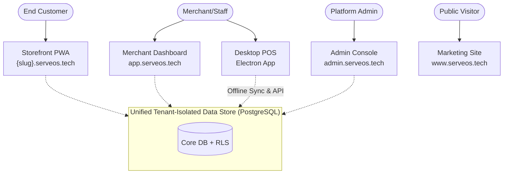

# ServeOS: Project Overview & Vision

ServeOS is a **multi-tenant SaaS commerce & operations platform** designed for SMBs in **Egypt** (primary) and **Saudi Arabia** (expansion). 

It bridges walk-in counter POS and online ordering into a **single unified tenant-isolated data store**. Whether a sale originates at the counter POS or as an online order, it is stored and processed identically. 

The platform features a **multi-vertical engine** supporting:
- **Restaurant**: Modifiers, recipes, dine-in/pickup/delivery
- **Retail**: Variants, barcodes, finished-goods stock
- **Pharmacy**: Prescription upload/review
- **Timber**: Dimensional cut-lists (m/m2/bf), kerf calculations

## Five Connected Surfaces

ServeOS operates across 5 interconnected applications, routing via a unified host-based proxy:

1. **Storefront PWA** (`{slug}.serveos.tech`): Customer-facing installable web store per tenant.
2. **Merchant Dashboard** (`app.serveos.tech`): Back-office for catalog, orders, inventory, staff, and analytics.
3. **Platform Admin Console** (`admin.serveos.tech`): Super-admin for tenant approvals, billing audit, and system health.
4. **Marketing Site** (`www.serveos.tech`): Public landing, pricing, and plan enquiry forms (bilingual EN/AR).
5. **Desktop POS** (`apps/pos`): Electron app for counter sales, shifts, cash drawer, and X/Z reports.

## Tech Stack Summary

> [!WARNING]
> We use **Next.js 16 (App Router)**. Be aware of breaking changes from Next.js 14/15, particularly around caching, Server Actions, and data fetching.

- **Framework:** Next.js 16 (App Router, Turbopack)
- **Frontend:** React 19, Tailwind CSS v4, Radix UI, Lucide, Recharts
- **Database:** PostgreSQL + Drizzle ORM, Row-Level Security (RLS) for tenant isolation
- **POS Desktop:** Electron + Vite + React + Better-SQLite3 (offline event log)
- **Testing:** Vitest (unit + DB integration) + Playwright (E2E)
- **Deployment:** Vercel (Web), Supabase (Production DB), Cloudflare R2 (Backups)

## Business Model

ServeOS operates as a **B2B2C SaaS**. Tenants (businesses) subscribe to the platform, and their customers use the storefront.

- **3-tier subscription in EGP:**
  - **Basic**: Free, 1 branch
  - **Pro**: 499 EGP/month, up to 3 branches
  - **Enterprise**: Custom pricing
- **Billing**: Manual billing implemented behind a `BillingProvider` interface (payment gateway integration is pending).

## Key Architectural Decisions

These 9 locked decisions from the roadmap govern our architectural constraints:

- **D1:** Append-only hash-chained tamper-evident audit log
- **D2:** Daily close + cash drawer reconciliation
- **D3:** Paymob-first payment gateway (PARKED)
- **D4:** Recipe/BOM auto-deduction (FIFO lots)
- **D5:** Full PO lifecycle purchasing
- **D6:** Cross-channel dual-surface reporting
- **D7:** Resend email provider
- **D8:** ETA e-invoicing & e-receipts (Egypt)
- **D9:** Both recipe and finished-goods stock per product

## Documentation Map

This README is the main entry point to all ServeOS documentation.

| Document | Path | Description |
|----------|------|-------------|
| Domain Glossary | [CONTEXT.md](../CONTEXT.md) | Every domain term defined |
| Functional Requirements | [docs/requirements/functional.md](./requirements/functional.md) | Multi-vertical engine & functional module workflows |
| Non-Functional Requirements | [docs/requirements/non-functional.md](./requirements/non-functional.md) | Latency budgets, security, RLS, scalability & compliance |
| Architecture Overview | [docs/architecture/overview.md](./architecture/overview.md) | System architecture with C4 diagrams |
| Sequence & Flow Diagrams | [docs/flows/sequence-diagrams.md](./flows/sequence-diagrams.md) | 10 critical end-to-end Mermaid sequence diagrams |
| State Machines | [docs/flows/state-machines.md](./flows/state-machines.md) | 9 finite state machines & transition matrices |
| Developer Onboarding | [docs/getting-started/onboarding.md](./getting-started/onboarding.md) | New developer → productive in < 1 day |
| Codebase Conventions | [docs/getting-started/codebase-conventions.md](./getting-started/codebase-conventions.md) | Directory structure, naming rules & patterns |
| Database Design & ERD | [docs/database/erd.md](./database/erd.md) | Complete data model & Mermaid ERD |
| Database Tables Reference | [docs/database/tables.md](./database/tables.md) | Exhaustive reference of all 72 tables from Drizzle schema |
| Master API Reference | [docs/api/README.md](./api/README.md) | Master API index (64 endpoints & 31 Server Actions) |
| Testing Strategy & Gaps | [docs/testing/testing-strategy-and-gaps.md](./testing/testing-strategy-and-gaps.md) | Multi-tier test pyramid, harnesses & roadmap debt |
| Roadmap | [docs/ROADMAP.md](./ROADMAP.md) | Spec sequencing + locked decisions (D1–D9) |
| PRDs | [docs/prds/MASTER-PRD.md](./prds/MASTER-PRD.md) | Product requirements registry |
| Environments | [docs/references/environments.md](./references/environments.md) | Infrastructure map |

## Quick Start

For the full setup, see the [Developer Onboarding](./getting-started/onboarding.md) guide.

1. Ensure Postgres has a `NOBYPASSRLS` role and two databases (`serveos`, `serveos_test`).
2. Set up `.env.local` and `.env.test` with `DATABASE_URL` and `ROOT_DOMAIN=serveos.localhost`.
3. `npm ci`
4. `npm run db:migrate` (dev DB) and `npm run db:migrate:test` (test DB)
5. `npm run db:seed`
6. `npm run dev` — runs the web app on `serveos.localhost:3000`

## Testing

For comprehensive testing strategies, refer to the testing documentation.

- `npm run test` — unit + integration (Vitest, DB-backed, runs serially)
- `npm run pos:test` — Electron app's own test suite
- `npm run test:e2e` — Playwright E2E suite
- CI runs typecheck, migration-drift check, and the full test suite as a non-superuser on every PR.

## Environments & Deployment

> [!NOTE]
> Deploys are handled by Vercel and run migrations during the build. See [Environments](./references/environments.md) for full details.

| Env | URL | Deploys on | Database |
|---|---|---|---|
| Production | `www.serveos.tech` | push to `main` | Supabase prod (aws-1 pooler) |
| QA | `qa.serveos.tech` | push to `qa` | Supabase `ServeOs-qa` (aws-0 pooler) |

## Local Test Users

Seeded by `npm run db:seed`. These are non-secret local dev accounts:

| Surface | URL | Credentials |
|---|---|---|
| Platform admin | `admin.serveos.localhost:3000/admin/login` | `admin@serveos.com` / `admin1234` |
| Roma owner | `app.serveos.localhost:3000/login` (slug `roma`) | `owner@roma.com` / `owner1234` |
| Roma manager | same | `manager@roma.com` / `manager1234` |
| Roma staff | same | `staff@roma.com` / `staff1234` |
