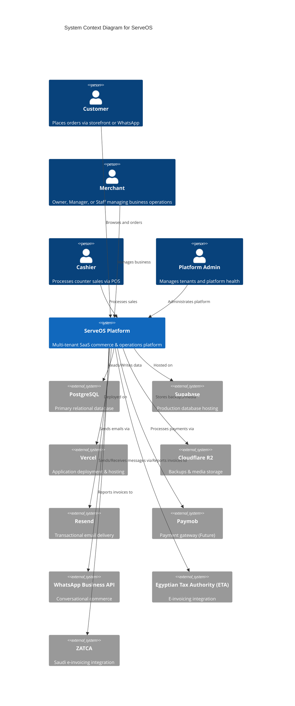
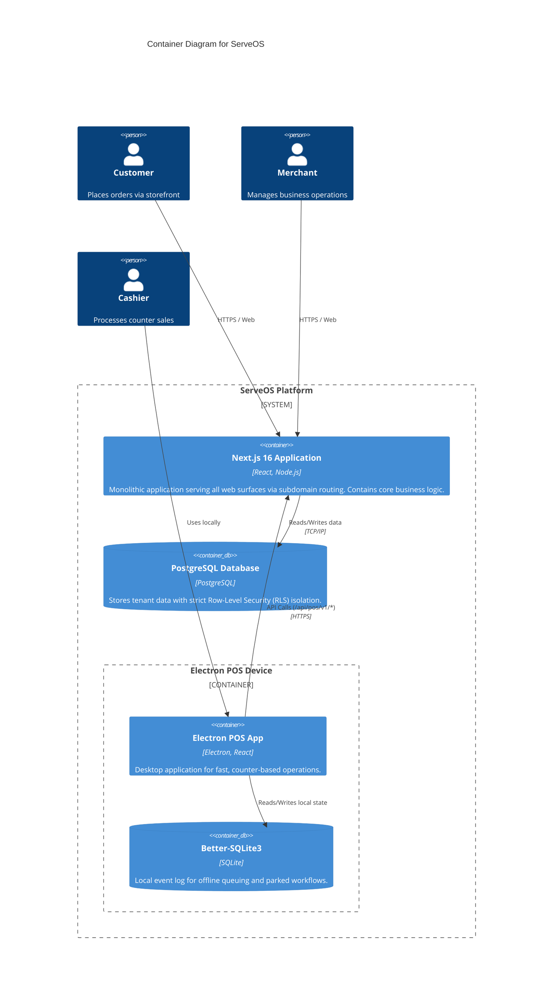
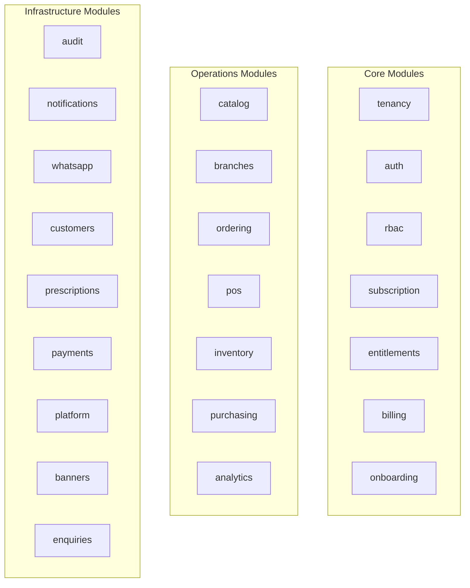
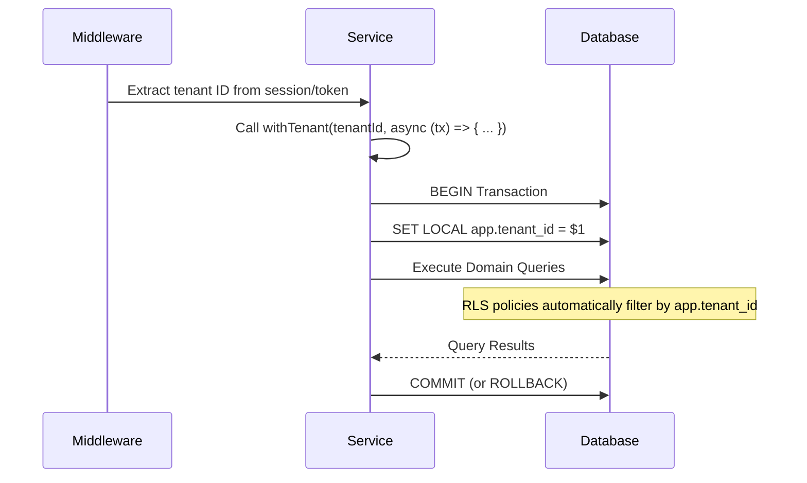

# ServeOS Architecture Overview

This document provides a comprehensive overview of the ServeOS architecture, designed for both technical stakeholders and business leaders. ServeOS is a multi-tenant SaaS commerce and operations platform built to serve multiple business verticals from a single, unified codebase.

## 1. System Context (C4 Level 1)

The system context diagram illustrates ServeOS in its environment, showing the users who interact with it and the external systems it depends on.

## 2. Container Diagram (C4 Level 2)

This diagram shows the major deployable units that make up the ServeOS platform.

## 3. Multi-Surface Routing

ServeOS utilizes a single Next.js 16 application to serve multiple distinct web surfaces. The routing logic is handled by `src/proxy.ts` and Next.js middleware, which direct traffic based on the requested subdomain.

| Subdomain Pattern | Surface | Purpose |
|---|---|---|
| `{slug}.serveos.tech` | Storefront PWA | Customer ordering and catalog browsing |
| `app.serveos.tech` | Merchant Dashboard | Business management, analytics, and settings |
| `admin.serveos.tech` | Admin Console | Platform administration and tenant onboarding |
| `www.serveos.tech` | Marketing Site | Public landing page and pricing |
| Desktop (not web) | POS Electron App | Counter operations communicating via `/api/pos/v1/*` |

> [!NOTE]
> During local development, the platform uses `.serveos.localhost` on port 3000 to simulate the multi-subdomain environment.

## 4. Domain Module Architecture

Business logic is organized into **27 decoupled domain modules** located under `src/server/`. 

> [!IMPORTANT]
> **Module Encapsulation:** Each module exposes its public interface strictly via an `index.ts` barrel file. No module is permitted to directly import another module's internal files.

## 5. Multi-Tenancy Architecture

ServeOS implements a robust data isolation strategy using PostgreSQL Row-Level Security (RLS). 

- Every tenant-scoped table features a `tenant_id` column and uses `FORCE ROW LEVEL SECURITY`.
- The application uses a `withTenant(tenantId, tx => ...)` wrapper which sets a PostgreSQL session variable (`app.tenant_id`).
- RLS policies automatically filter all queries within the transaction to ensure they only affect the active tenant.
- **Control-plane tables** (e.g., users, pos_devices, platform audit_logs) intentionally lack RLS as they govern cross-tenant or platform-level concerns.
- The database connection uses the `serveos_app` role, which is `NOSUPERUSER NOBYPASSRLS`. (A superuser would silently bypass RLS).
- Continuous Integration (CI) tests explicitly run as this non-superuser role to verify RLS policies are actively enforced.

### RLS Request Flow

## 6. Multi-Vertical Engine

A core differentiator of ServeOS is its ability to serve multiple distinct business verticals from a unified codebase: `restaurant`, `retail`, `pharmacy`, and `timber`.

The tenant's `vertical` field determines which **capabilities** are active in the system:
- **Capabilities:** Features like `modifiers` (restaurant), `variants` (retail), `prescriptions` (pharmacy), `cutLists` (timber), `stockTracking`, and `recipes` are toggled based on the vertical.
- **Adaptive Modules:** Core modules like catalog, ordering, and inventory dynamically adjust their validation and behavior based on the active capabilities.
- **Dynamic UI:** The customer storefront and merchant dashboard render different interfaces and terminology tailored to the specific vertical.

## 7. POS Architecture

The Electron-based POS application is designed for speed and reliability at the counter.

- **Thin Client:** The POS retains minimal business logic. The Electron main process holds device and cashier credentials, proxying strongly-typed API calls to the server at `/api/pos/v1/*`.
- **IPC Communication:** The React renderer communicates with the main process securely via a context-bridge (`window.pos`).
- **Authentication:** Requests are authenticated using a device Bearer token combined with an `X-POS-Cashier` header to identify the active operator.
- **Offline Resilience:** A local `Better-SQLite3` database acts as an offline event log, allowing caching of parked orders and work-in-progress during connectivity drops.
- **Shared Logic:** Critical calculations, such as money math (`src/lib/order-totals.ts`) and shift math (`src/server/pos/shift-math.ts`), are shared between the server and the POS client to guarantee consistency.

## 8. Data Integrity

Ensuring accurate and tamper-evident data is paramount for financial and operational records.

- **Hash-Chained Audit Log:** Every significant mutation is recorded in `audit_events`. Entries include a SHA-256 hash of their contents and the `prev_hash`, creating a tamper-evident chain per tenant.
- **Append-Only Ledger:** Stock movements are recorded in `stock_ledger`. These records are never updated or deleted, only appended, ensuring a complete and auditable history.
- **Idempotency:** The system uses distinct tables like `pos_order_receipts` and `whatsapp_order_receipts` to idempotently process incoming requests and prevent duplicate sales.
- **Advisory Locks:** Critical sequential operations, such as generating gapless order numbers or advancing the audit chain, utilize PostgreSQL advisory locks (`pg_advisory_xact_lock`) to prevent race conditions.

## 9. Deployment Architecture

The infrastructure relies on modern managed services to ensure scalability and reliability.

- **Production Environment:** Deployed on Vercel with automatic deployments from the `main` branch. The production database is hosted on Supabase.
- **QA Environment:** Deployed on Vercel from the `qa` branch, connected to a dedicated, separate Supabase instance.
- **Database Migrations:** Migrations execute during the Vercel build phase via `scripts/release-migrate.ts`. A failed migration results in a failed build, preventing broken deployments.
- **Preview Deployments:** Pull request preview deployments skip database migrations, as they share the production database (running migrations on previews would be dangerous).
- **Data Backups:** Automated, nightly `pg_dump` processes back up the database to Cloudflare R2 at 03:00 UTC.
