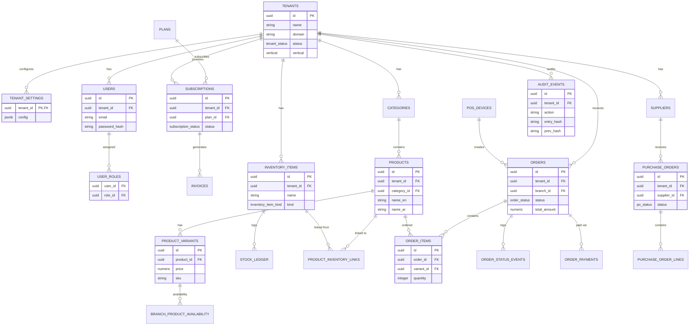

# ServeOS Database Design & ERD

## 1. Database Overview
ServeOS uses PostgreSQL managed via the **Drizzle ORM**.
- **Tenant Isolation**: Multi-tenancy is enforced natively in the database through PostgreSQL **Row-Level Security (RLS)**. It uses `FORCE ROW LEVEL SECURITY` alongside the `app.tenant_id` session variable to strictly scope queries.
- **Schema Distribution**: The schema declarations are distributed across the domain modules under `src/server/*/schema.ts` and aggregated in `src/db/schema.ts`.
- **Migrations**: Found in the `drizzle/` directory. Currently, there are 46 migrations defining the database shape.

## 2. Core Entity Relationship Diagram (ERD)
The following Mermaid ERD visualizes the **Core** tables (approximately 30 key tables), demonstrating how modules connect logically.

## 3. Enum Reference
ServeOS relies heavily on PostgreSQL Enums for state machines. Below are the key enums across the modules.

| Enum Name | Values |
|-----------|--------|
| `tenant_status` | `onboarding`, `trial`, `active`, `suspended`, `rejected` |
| `vertical` | `restaurant`, `retail`, `pharmacy`, `timber` |
| `audit_actor_type` | `user`, `system`, `device`, `customer` |
| `invoice_status` | `open`, `pending_verification`, `paid`, `void` |
| `customer_status` | `active`, `disabled` |
| `inventory_item_kind` | `ingredient`, `finished_good`, `raw_material` |
| `storage_location_kind` | `kitchen`, `retail`, `back_of_house`, `transit` |
| `product_inventory_link_type` | `recipe`, `finished_good` |
| `stock_count_status` | `open`, `committed`, `cancelled` |
| `notification_type` | `alert`, `system`, `message` |
| `notification_severity` | `info`, `warning`, `critical` |
| `outbox_status` | `queued`, `sending`, `sent`, `failed` |
| `email_event_type` | `delivered`, `bounced`, `complained`, `opened` |
| `application_status` | `pending`, `approved`, `rejected` |
| `order_status` | `new`, `accepted`, `preparing`, `ready`, `completed`, `cancelled` |
| `fulfillment_type` | `pickup`, `delivery` |
| `order_channel` | `web`, `pos`, `whatsapp` |
| `payment_status` | `unpaid`, `pending_verification`, `partially_paid`, `paid`, `refunded`, `partially_refunded` |
| `rx_review_status` | `not_required`, `pending`, `approved`, `rejected` |
| `payment_method` | `cash`, `instapay`, `vodafone_cash`, `mobile_wallet` |
| `prescription_status` | `pending`, `approved`, `rejected` |
| `po_status` | `draft`, `submitted`, `partially_received`, `received`, `cancelled` |
| `subscription_status` | `active`, `past_due`, `canceled`, `trialing` |
| `whatsapp_account_status` | `active`, `disconnected`, `suspended` |
| `whatsapp_direction` | `inbound`, `outbound` |
| `whatsapp_conversation_state` | `open`, `closed`, `pending` |
| `whatsapp_status_queue_status` | `queued`, `sent`, `skipped`, `failed` |

## 4. Table-by-Cluster Documentation

### Tenancy & Config (2 tables)
- **`tenants`**: Represents the root organization/business entity. Includes domain, status, and vertical. Contains RLS policies based on `tenant_id`.
- **`tenant_settings`**: Stores granular JSON-based configuration overrides for the tenant.

### Auth & RBAC (4 tables)
- **`users`**: Platform or tenant-level users.
- **`sessions`**: Active login sessions.
- **`roles`**: Defines permissions.
- **`user_roles`**: Links users to their assigned roles.

### Subscription & Billing (5 tables)
- **`plans`**: Available SaaS tiers.
- **`subscriptions`**: The active plan assigned to a tenant.
- **`usage_counters`**: Tracks quota consumption.
- **`invoices`**: Billing records for subscriptions or usage.
- **`onboarding_applications` / `plan_enquiries`**: Lead capture and sign-up flows.

### Branches & Delivery (2 tables)
- **`branches`**: Physical locations for a tenant.
- **`delivery_areas`**: Geofenced polygons or radius configurations mapped to branches.

### Catalog & Menu (8 tables)
- **`categories`**: Taxonomic organization of items.
- **`products`**: The canonical representation of an item, containing `name_en` and `name_ar`.
- **`product_variants`**: Pricing and SKUs (e.g., Size: Large, Small).
- **`modifier_groups` & `modifier_options`**: For customizations (e.g., "Add Cheese").
- **`branch_product_availability`**: Branch-specific override for stock or active status.
- **`catalog_versions`**: Snapshots for menu publishing.
- **`banners`**: Promotional visual assets.

### Orders (4 tables)
- **`orders`**: Central sales record.
- **`order_items`**: The individual variants purchased on an order.
- **`order_status_events`**: Append-only audit log tracking state changes.
- **`tenant_offline_methods`**: Payment methods allowed offline.

### POS (13 tables)
- **`pos_devices`**: Registered point-of-sale hardware instances (No RLS - control plane).
- **`pos_pairing_codes`**: Short-lived codes to authenticate a device.
- **`pos_order_receipts`**: Idempotency records tracking (device_id + client_order_id) to prevent duplicate syncs.
- **`pos_cashier_sessions`**: Bearer token based sessions.
- **`pos_grants`**: Device-level permissions.
- **`pos_sync_event_receipts`**: Event sync idempotency.
- **`order_payments`**: Captured transactions applied against an order.
- **`pos_adjustment_events`**: Append-only log of modifications to closed tickets.
- **`pos_held_tickets`**: Local offline orders saved before checkout.
- **`pos_shifts`, `cash_movements`, `cash_counts`**: Till management and reconciliation.
- **`refunds`, `refund_lines`, `refund_payments`**: Processed returns.

### Audit (3 tables)
- **`audit_logs`**: Platform-wide security actions.
- **`audit_events`**: Tenant-scoped, append-only, and cryptographically hash-chained (`entry_hash`, `prev_hash`).
- **`audit_chain_heads`**: Pointers to the latest event in the hash chain per tenant.

### WhatsApp (6 tables)
- **`whatsapp_accounts`**: Integrated Meta Business accounts.
- **`whatsapp_messages`**: Individual sent/received payloads.
- **`whatsapp_conversations`**: Aggregated threads.
- **`whatsapp_order_receipts`**: Idempotency for order confirmations (`conversation_id` + `confirm_message_id`).
- **`cart_handoff_tokens`**: Bridges web cart to WA checkout.
- **`whatsapp_status_queue`**: Processing queue for outbound webhooks.

### Notifications (3 tables)
- **`notifications`**: In-app alerts for users.
- **`notification_outbox`**: Transactional outbox pattern for async delivery.
- **`email_events`**: SendGrid/Postmark webhook delivery statuses.

### Customers & Prescriptions (3 tables)
- **`customers`**: CRM records for end-buyers.
- **`customer_sessions`**: Authenticated web/app sessions.
- **`prescriptions`**: Pharmacy-vertical specific uploaded Rx documents requiring `rx_review_status` approval.

### Inventory (9 tables)
- **`inventory_items`**: Base tracked material (ingredients, finished goods).
- **`storage_locations`**: Where items are physically kept.
- **`inventory_lots`**: Batches (for expiry or FIFO).
- **`stock_ledger`**: Append-only double-entry inventory transactions.
- **`recipes` & `recipe_components`**: BOM (Bill of Materials) mapping products to raw materials.
- **`product_inventory_links`**: Maps a catalog Product to an Inventory Item.
- **`stock_counts` & `stock_count_lines`**: Physical inventory reconciliation.

### Purchasing (6 tables)
- **`suppliers`**: Vendors that supply inventory.
- **`supplier_items`**: Catalog from suppliers.
- **`purchase_orders`**: Issued POs.
- **`purchase_order_lines`**: Items requested on the PO.
- **`po_receipts` & `po_receipt_lines`**: Goods Receiving Notes (GRN) logging delivered items.
- **`reorder_rules`**: Par level configurations for auto-replenishment.

## 5. Migration Strategy
ServeOS uses **Drizzle Kit** to generate SQL migrations.
- **Naming Convention**: `NNNN_slug.sql` (e.g., `0000_stale_korg.sql` to `0045_worthless_stellaris.sql`).
- **Local Dev**: Run `npm run db:migrate` or `npm run db:migrate:test`.
- **Production CI/CD**: Migrations execute automatically during the Vercel build phase via `scripts/release-migrate.ts`.
- **Safety**: A failed migration implies a failed build, preventing broken deployments.

## 6. Key Design Patterns
1. **Tenant Isolation**: Every tenant-scoped table strictly includes `tenant_id` as a foreign key, integrated with Postgres RLS.
2. **Bilingual Text**: Use of the `name_en` and `name_ar` pattern across the platform for comprehensive localization in Arabic and English.
3. **Money Representation**: Financial amounts are stored as exact `numeric` strings via a `money(n)` convention. Floating-point types are strictly prohibited.
4. **Timestamps**: All timestamps use `timestamp with time zone` natively and default to `defaultNow()`.
5. **IDs**: Primary keys are invariably UUIDs generated using `defaultRandom()`.
6. **Append-Only Logs**: Critical state changes use append-only tables (`audit_events`, `stock_ledger`, `order_status_events`, `pos_adjustment_events`). Records are inserted, never updated.
7. **Idempotency**: External webhook processors and offline devices utilize idempotency tables (e.g., `pos_order_receipts`, `whatsapp_order_receipts`) to safely replay sync requests.
8. **Hash Chaining**: The `audit_events` log is cryptographically secured per tenant. Every row contains an `entry_hash` and a `prev_hash` (SHA-256) ensuring temper-evident continuity.
