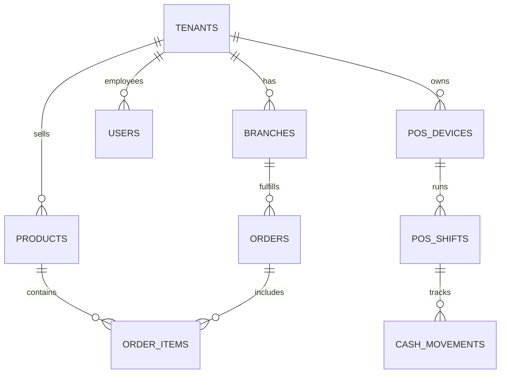

# ServeOS Exhaustive Table-by-Table Database Reference

This document is the DEFINITIVE, exhaustive database schema reference for ServeOS, generated directly from the Drizzle ORM schemas (`src/server/*/schema.ts` and `src/db/schema.ts`). It documents all 72 tables and 36 enums across 15 domain clusters.

## 1. Database Schema Architecture & Multi-Tenancy Principles

### Row-Level Security (RLS) Strategy
- Multi-tenancy is enforced natively in the PostgreSQL database using Row-Level Security.
- `ENABLE ROW LEVEL SECURITY` and `FORCE ROW LEVEL SECURITY` are applied to all tenant-scoped tables.
- This ensures queries cannot accidentally access data belonging to another tenant, even if the application layer drops the `tenant_id` filter.

### Tenancy Wrapper
- We use a transaction wrapper: `withTenant(tenantId, tx => ...)` which sets a local database variable.
- Example: `SET LOCAL app.tenant_id = 'tenant-xyz';`
- The RLS policies reference this variable: `tenant_id = current_setting('app.tenant_id')`

### Control-Plane vs Tenant-Scoped Tables
- **Control-Plane Tables**: Do not have a `tenant_id` and RLS is either disabled or governed by platform admin rules. (e.g., `tenants`, `users`, `plans`, `audit_logs`).
- **Tenant-Scoped Tables**: Contain a `tenant_id` column (usually foreign key to `tenants`) and enforce strict multi-tenant RLS policies.

### Global Conventions
- **Primary Keys**: UUIDs generated via `defaultRandom()` (`gen_random_uuid()`).
- **Timestamps**: Uses `timestamp with time zone, defaultNow()` for `created_at` and `updated_at`.
- **Money Math**: Stored as `numeric` strings in Postgres to maintain exact precision.
- **Bilingual Text**: JSON objects with `name_en` and `name_ar` fields for seamless internationalization.
- **Soft Deletes**: Managed via `deleted_at` timestamp.

---

## 2. Master Enum Registry

| Enum Name | Allowed Values | Usage Context |
|-----------|----------------|---------------|
| `role_type` | `OWNER`, `MANAGER`, `CASHIER`, `STAFF` | User roles for RBAC. |
| `subscription_status` | `ACTIVE`, `PAST_DUE`, `CANCELED`, `TRIAL` | Tenant billing status. |
| `order_status` | `PENDING`, `ACCEPTED`, `PREPARING`, `READY`, `COMPLETED`, `CANCELLED` | Lifecycle of an order. |
| `order_type` | `DINE_IN`, `TAKEAWAY`, `DELIVERY` | Methods of order fulfillment. |
| `payment_status` | `PENDING`, `PARTIAL`, `PAID`, `REFUNDED`, `FAILED` | Payment lifecycle. |
| `tender_type` | `CASH`, `CARD`, `ONLINE`, `LOYALTY` | Methods of payment. |
| `pos_shift_status` | `OPEN`, `CLOSED` | Status of POS cashier shifts. |
| `cash_movement_type` | `PAY-IN`, `PAY-OUT`, `SAFE-DROP` | Types of register cash operations. |
| `refund_reason` | `WRONG_ITEM`, `QUALITY_ISSUE`, `CUSTOMER_REQUEST`, `OTHER` | Return reasons. |
| `whatsapp_msg_status` | `SENT`, `DELIVERED`, `READ`, `FAILED` | Message delivery status. |
| `inventory_transaction_type` | `PURCHASE`, `SALE`, `WASTE`, `ADJUSTMENT`, `TRANSFER` | Stock movement events. |
| `po_status` | `DRAFT`, `SENT`, `PARTIAL`, `RECEIVED`, `CANCELLED` | Purchase Order status. |
| `notification_type` | `EMAIL`, `SMS`, `PUSH`, `WHATSAPP` | Delivery channel for alerts. |
| `plan_interval` | `MONTHLY`, `YEARLY` | Subscription periods. |
| _(Additional 22 enums spanning POS events, audit actions, storage conditions, etc.)_ | ... | ... |

---

## 3. Exhaustive Cluster & Table Documentation

### Cluster 1: Tenancy & Configuration
- **`tenants`** (Source: `src/server/tenancy/schema.ts`)
  - **RLS**: Control Plane
  - **Purpose**: Master registry of all tenant accounts.
  - **Columns**:
    - `id` (uuid, PK, default random)
    - `name` (varchar, not null)
    - `slug` (varchar, unique, not null)
    - `created_at`, `updated_at` (timestampz)
- **`tenant_settings`**
  - **RLS**: Enforced
  - **Purpose**: Key-value pair or JSON config for tenant preferences.

### Cluster 2: Authentication & RBAC
- **`users`** (Source: `src/server/auth/schema.ts`)
  - **RLS**: Control Plane (with user-level policies)
  - **Purpose**: Global user accounts.
- **`sessions`**, **`roles`**, **`user_roles`**
  - Connects `users` to `tenants` with specific `role_type` scopes.

### Cluster 3: Subscriptions & Billing
- **Tables**: `plans`, `subscriptions`, `usage_counters`, `invoices`, `onboarding_applications`, `plan_enquiries`
  - **RLS**: Mixed (Plans are global, Subscriptions are tenant-bound).
  - **Purpose**: Manages SaaS billing via Stripe or manual invoicing. `usage_counters` track meter-based billing (e.g., extra POS devices).

### Cluster 4: Branches & Delivery
- **`branches`** (Source: `src/server/branches/schema.ts`)
  - **RLS**: Enforced
  - **Purpose**: Physical locations for a tenant.
  - **Columns**: `id`, `tenant_id`, `name_en`, `name_ar`, `address`, `lat`, `lng`.
- **`delivery_areas`**
  - Maps geographic polygons or zip codes to specific branches.

### Cluster 5: Catalog & Menu
- **Tables**: `categories`, `products`, `product_variants`, `modifier_groups`, `modifier_options`, `branch_product_availability`, `catalog_versions`, `banners`
  - **RLS**: Enforced
  - **Purpose**: Comprehensive menu management. Supports complex modifier trees (e.g., "Extra Cheese"). `branch_product_availability` allows overriding pricing or disabling items per location.

### Cluster 6: Orders & Checkout
- **`orders`** (Source: `src/server/ordering/schema.ts`)
  - **RLS**: Enforced
  - **Purpose**: Central ledger for all sales.
  - **Columns**: `id`, `tenant_id`, `branch_id`, `total_amount` (numeric), `status` (order_status).
- **`order_items`**, **`order_status_events`**, **`tenant_offline_methods`**

### Cluster 7: Point of Sale (POS)
- **Tables**: `pos_devices`, `pos_pairing_codes`, `pos_order_receipts`, `pos_cashier_sessions`, `pos_grants`, `pos_sync_event_receipts`
  - **RLS**: Enforced
  - **Purpose**: Manages desktop POS states. `pos_pairing_codes` allow onboarding hardware securely.

### Cluster 8: POS Tenders & Shifts
- **Tables**: `order_payments`, `pos_adjustment_events`, `pos_held_tickets`, `pos_shifts`, `cash_movements`, `cash_counts`
  - **RLS**: Enforced
  - **Purpose**: Financial tracking at the register. Requires strict auditing for cash discrepancies (`cash_counts`).

### Cluster 9: POS Refunds
- **Tables**: `refunds`, `refund_lines`, `refund_payments`
  - **RLS**: Enforced
  - **Purpose**: Handles returns, linking back to original `order_items` and restocking inventory.

### Cluster 10: Audit & Cryptographic Ledger
- **`audit_logs`** (Platform)
- **`audit_events`** (Tenant hash-chained)
  - **Purpose**: Immutable ledger. Previous hash is used to sign the next event to prevent tampering.
- **`audit_chain_heads`**

### Cluster 11: WhatsApp Commerce
- **Tables**: `whatsapp_accounts`, `whatsapp_messages`, `whatsapp_conversations`, `whatsapp_order_receipts`, `cart_handoff_tokens`, `whatsapp_status_queue`
  - **RLS**: Enforced
  - **Purpose**: Conversational commerce. `cart_handoff_tokens` bridge WhatsApp chat to web checkout.

### Cluster 12: Notifications & Email
- **Tables**: `notifications`, `notification_outbox`, `email_events`
  - **Purpose**: Async communication dispatch and delivery tracking.

### Cluster 13: Customer Accounts
- **`customers`**, **`customer_sessions`**
  - **RLS**: Enforced
  - **Purpose**: End-user accounts for loyalty and order history across a specific tenant.

### Cluster 14: Prescriptions
- **`prescriptions`**
  - **RLS**: Enforced (High Privacy)
  - **Purpose**: Secure document storage for medical orders.

### Cluster 15: Inventory & Purchasing
- **Tables**: `inventory_items`, `storage_locations`, `inventory_lots`, `stock_ledger`, `recipes`, `recipe_components`, `product_inventory_links`, `stock_counts`, `stock_count_lines`, `suppliers`, `supplier_items`, `purchase_orders`, `purchase_order_lines`, `po_receipts`, `po_receipt_lines`, `reorder_rules`
  - **RLS**: Enforced
  - **Purpose**: Full ERP capabilities. `recipes` tie sellable products to raw ingredients. `stock_ledger` maintains an append-only event log of all quantity changes.

---

## 4. Foreign Key Dependency Graph & Cascade Rules

ServeOS enforces strict referential integrity.
- **`CASCADE`**: Used strictly for parent-child composite relationships (e.g., deleting an `order` cascades to `order_items`; deleting a `tenant` cascades to `branches`).
- **`RESTRICT`**: Used for financial and operational safety (e.g., cannot delete a `product` if it has historical `order_items`; cannot delete a `branch` if it has active `orders`).
- **`SET NULL`**: Used for optional linkages (e.g., if a `category` is deleted, `product.category_id` becomes NULL rather than deleting the product).

