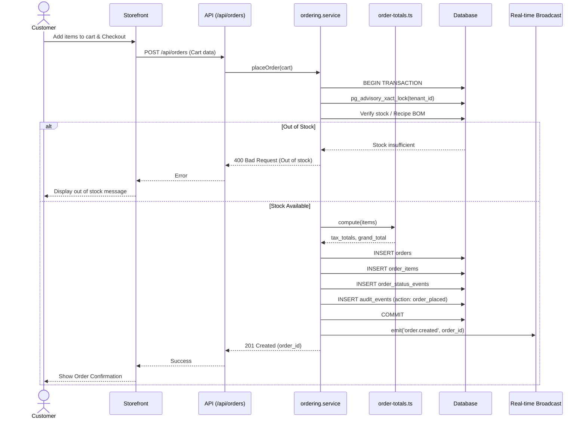
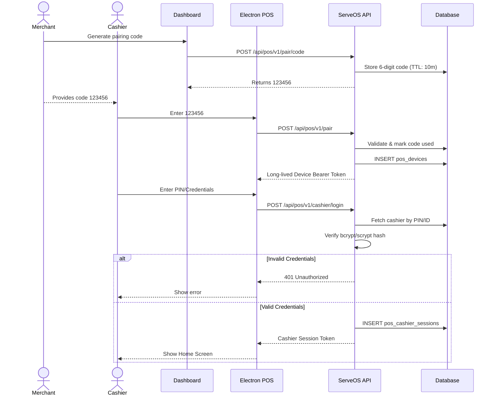
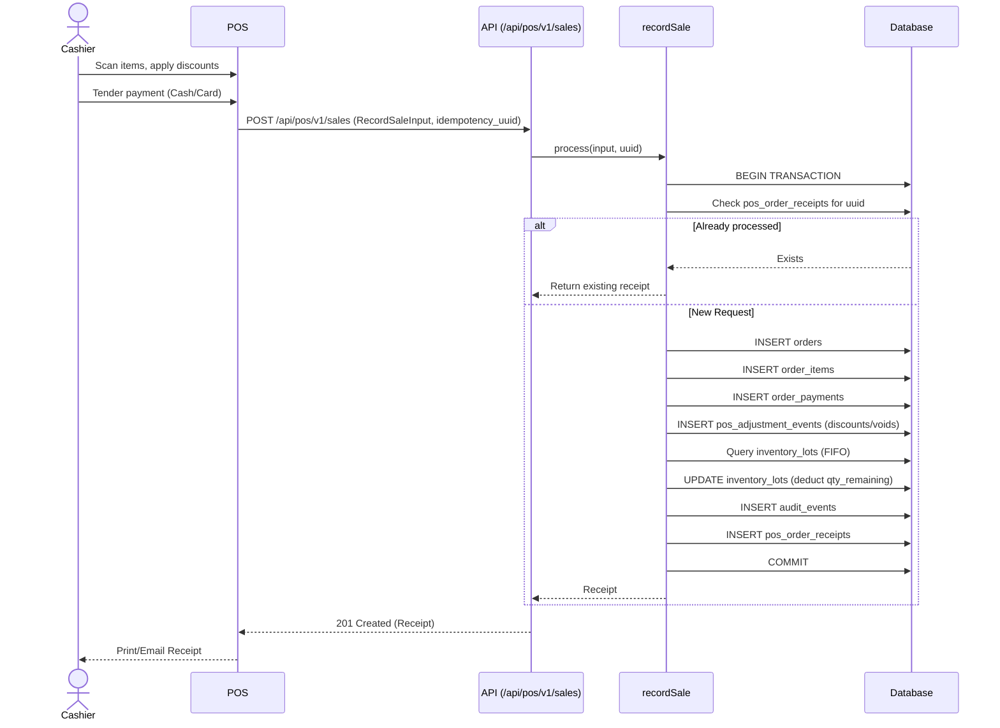
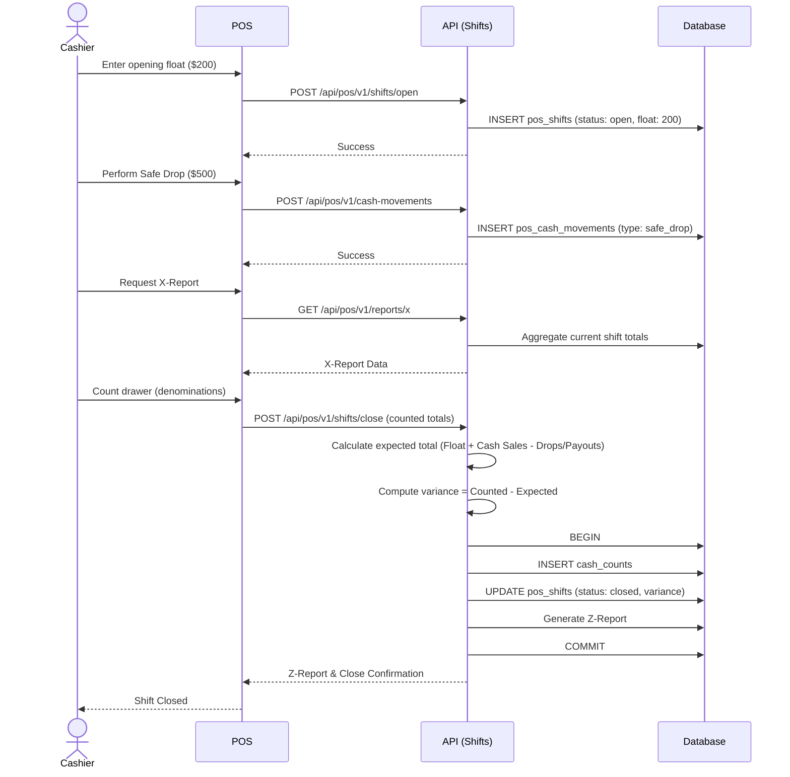
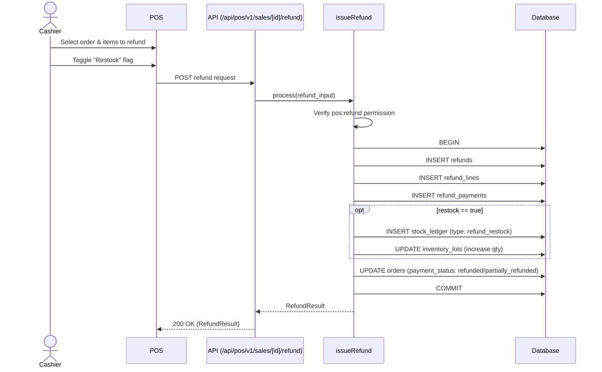
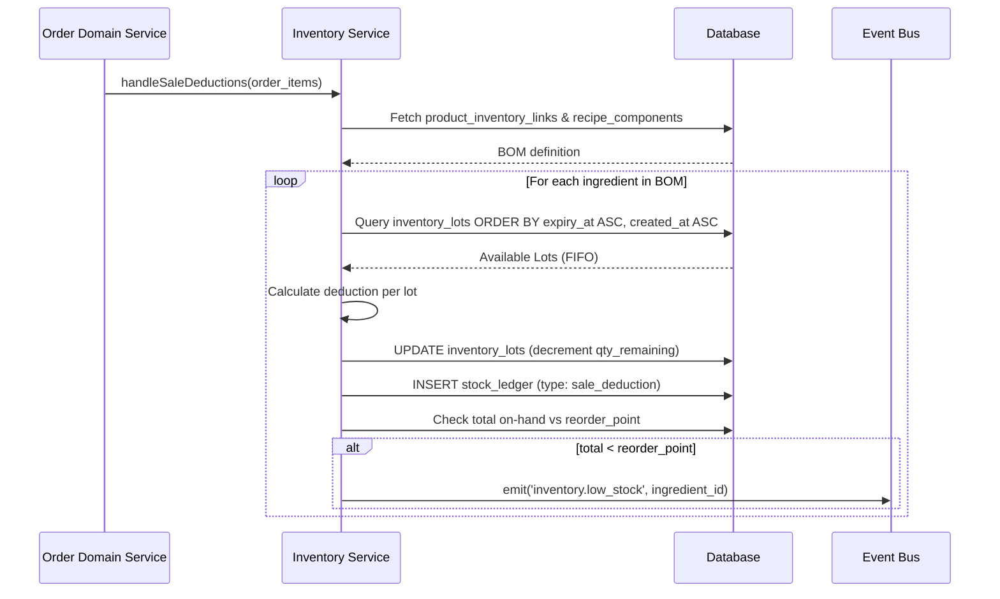
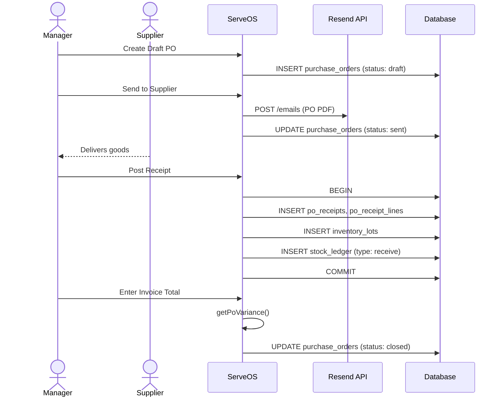
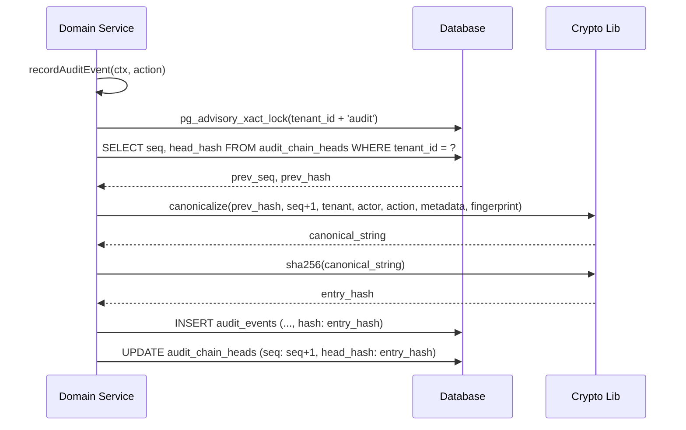
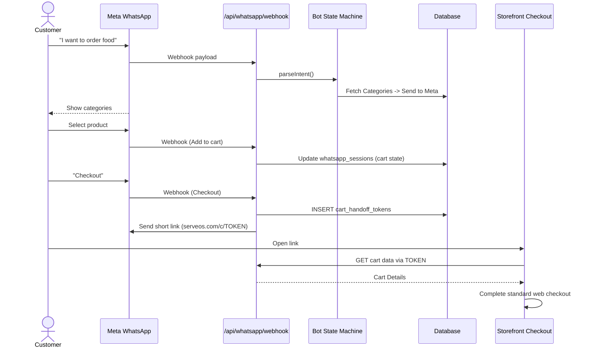
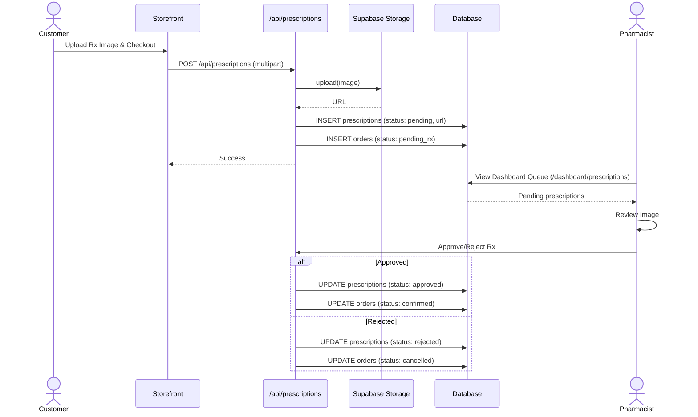

# ServeOS Sequence & Flow Diagrams

This document provides comprehensive, end-to-end Mermaid sequence diagrams illustrating data and control flow across surfaces, APIs, domain services, database transactions, and third-party systems in ServeOS.

## 1. Storefront Online Order Placement

**Description**: End-to-end flow of a customer placing an online order through the storefront.
**Actors**: Customer, Storefront App, ServeOS API, Domain Services, Database.
**Error Paths**: Out of stock, payment failure, invalid tax configuration.

## 2. POS Device Pairing & Cashier Authentication

**Description**: Flow for pairing an Electron POS device to a tenant and logging in a cashier.
**Actors**: Merchant (Dashboard), Cashier (POS), Server, Database.
**Error Paths**: Invalid/expired code, invalid credentials.

## 3. POS Sale Recording & Multi-Tender Payment

**Description**: Cashier rings up items, applies modifications, and tenders payment.
**Actors**: Cashier, POS, Server, Database.
**Error Paths**: Missing idempotency, invalid tender amounts.

## 4. POS Shift Lifecycle & Cash Drawer Reconciliation

**Description**: Opening a shift, performing cash movements, and closing the shift with variance checking.
**Actors**: Cashier, POS, Server, Database.

## 5. POS Refund & Restock Processing

**Description**: Refunding items from a previous sale and optionally returning them to stock.
**Actors**: Cashier, POS, Server, Database.

## 6. Inventory Recipe/BOM Auto-Deduction (FIFO Lots)

**Description**: Automatic deduction of raw ingredients based on recipe definitions when a product is sold.
**Actors**: Domain Service (Order Confirmation), Inventory Service, Database.

## 7. Purchase Order Lifecycle & Receiving

**Description**: End-to-end lifecycle of a purchase order, from draft to receiving and invoice reconciliation.
**Actors**: Manager, Supplier, ServeOS, Database, Resend (Email API).

## 8. Tamper-Evident Cryptographic Audit Chain

**Description**: Mechanism for recording immutable audit logs using cryptographic hashing to prevent tampering.
**Actors**: Any Domain Service, Database.

## 9. WhatsApp Conversational Ordering & Storefront Cart Handoff

**Description**: Customer builds a cart via WhatsApp bot and completes checkout on the web storefront.
**Actors**: Customer, Meta WhatsApp API, ServeOS Webhook, State Machine, Storefront Web.

## 10. Pharmacy Prescription Verification Flow

**Description**: Customer uploads a prescription during checkout, which requires pharmacist verification.
**Actors**: Customer, Storefront, ServeOS API, Supabase Storage, Pharmacist (Dashboard), DB.

