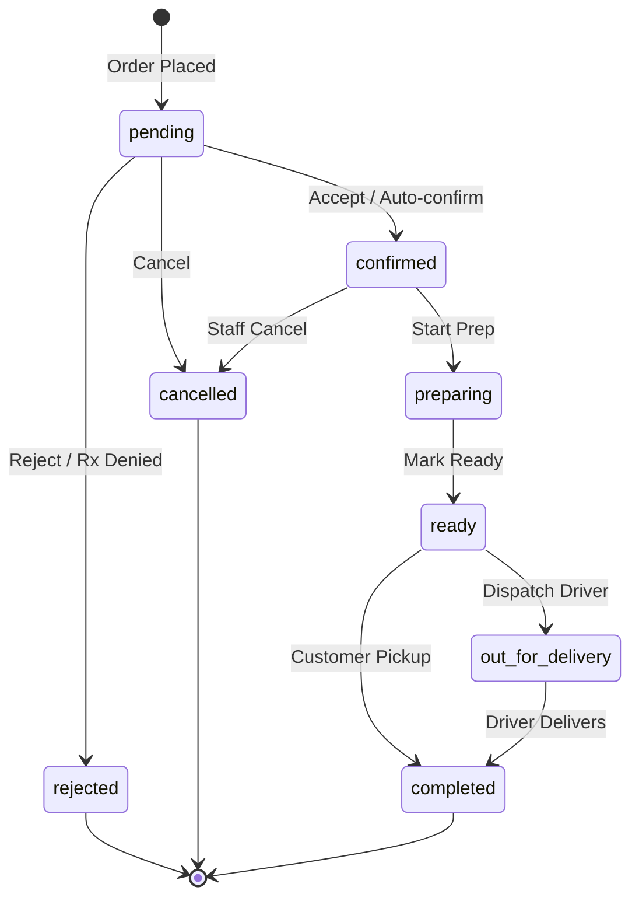
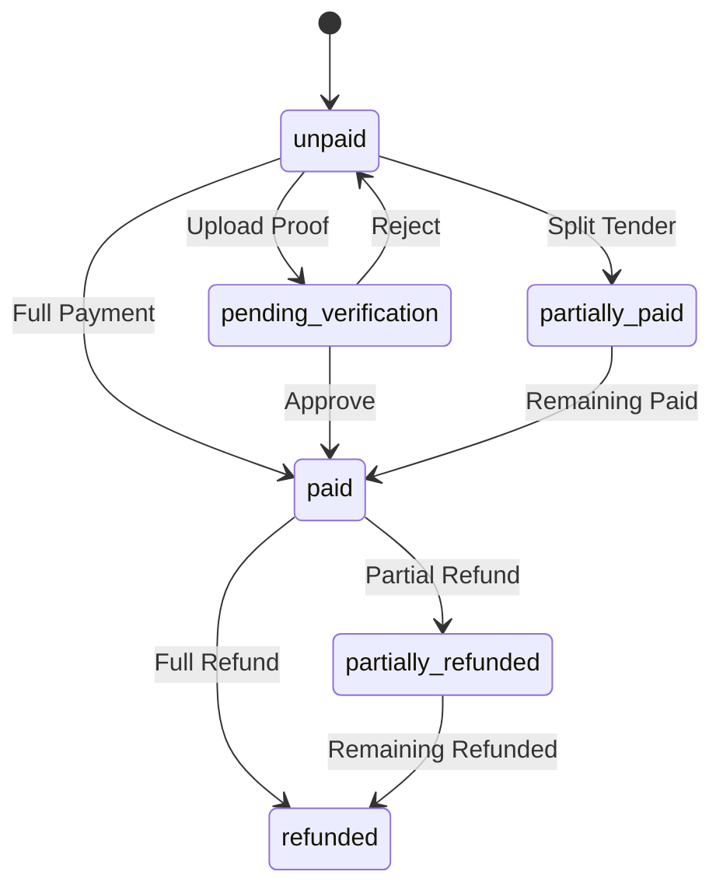
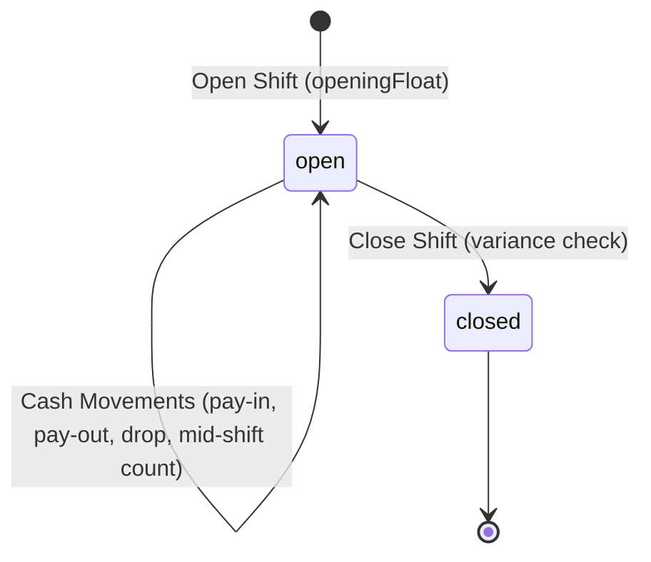
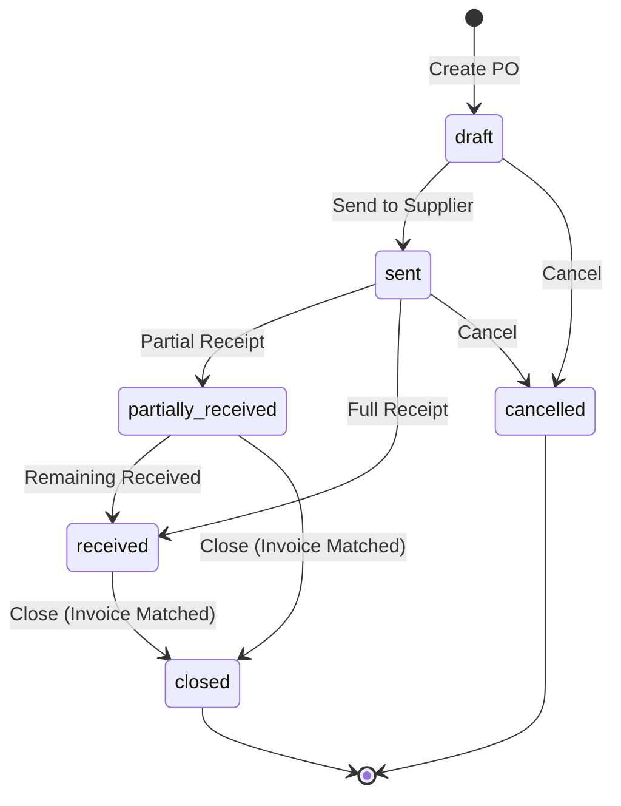
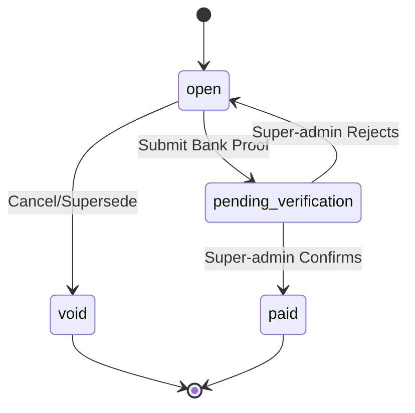
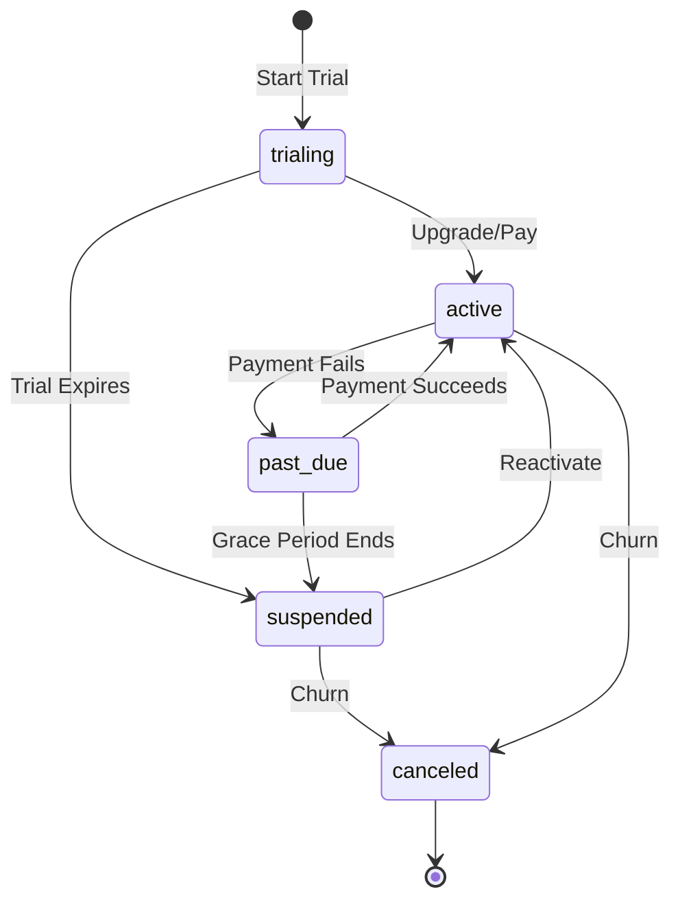
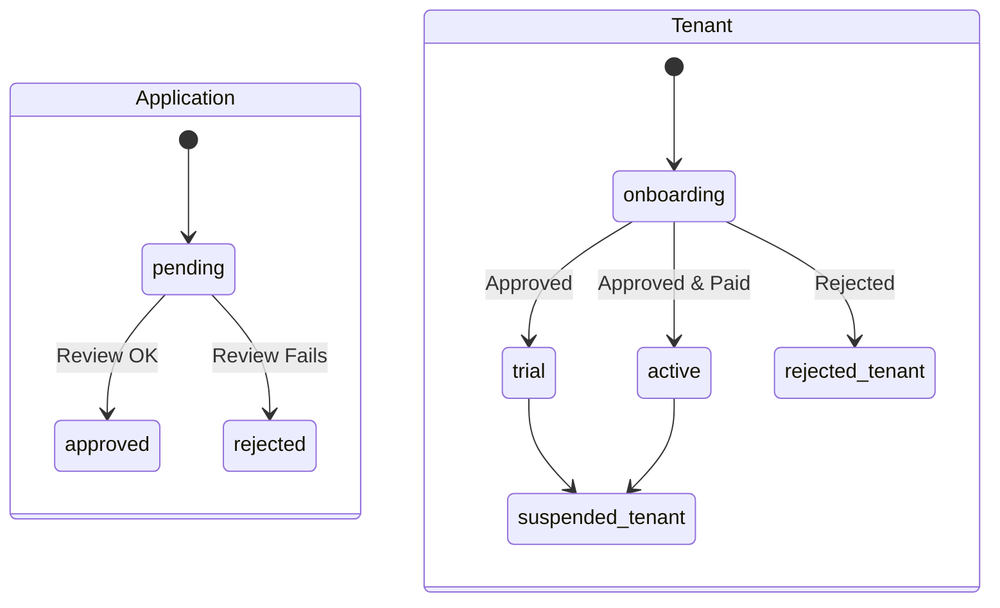
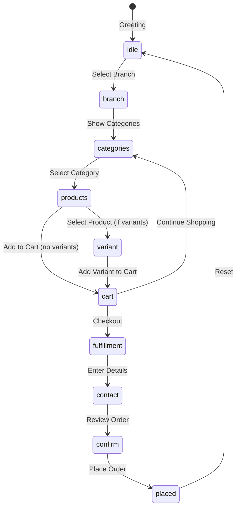
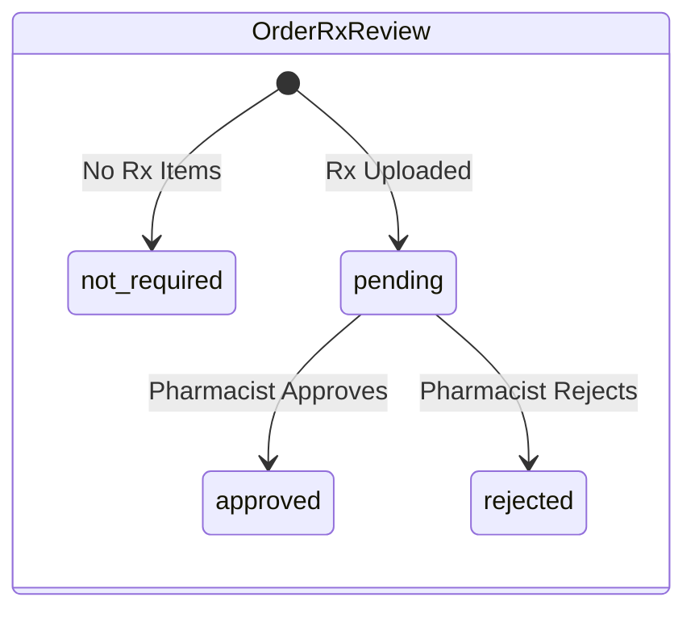

# ServeOS State Machines Documentation

This document details all finite state machines, entity lifecycles, valid transitions, trigger events, guard conditions, and side-effects across the ServeOS platform.

## 1. Order Status State Machine (`order_status`)

The `order_status` tracks the fulfillment lifecycle of an order from placement to completion or cancellation.

### Transition Matrix

| From | To | Event | Guard | Action / Side-Effect |
|------|----|-------|-------|----------------------|
| `[Initial]` | `pending` | Customer places order | | Log `order_status_events`, notify staff |
| `pending` | `confirmed` | Manager accepts (or auto-POS) | Prescription approved (if req) | Notify customer, audit log |
| `pending` | `rejected` | Manager rejects / Rx denied | | Refund payment (if captured), notify customer |
| `pending` | `cancelled` | User/Staff cancels | | Refund payment (if captured), notify customer |
| `confirmed` | `preparing` | Kitchen starts work | | Notify customer |
| `confirmed` | `cancelled` | Staff cancels | Cannot cancel once `preparing` | Refund payment |
| `preparing` | `ready` | Kitchen marks ready | | Notify customer (for pickup) |
| `ready` | `out_for_delivery` | Driver dispatched | Order type is `delivery`, `delivery_area_id` exists | Queue WhatsApp status update |
| `ready` | `completed` | Order handed over (pickup) | Order type is `pickup` | Close order |
| `out_for_delivery` | `completed` | Driver delivers | | Close order |

**Guards & Side Effects:**
- **Guards:** Cannot cancel once `preparing`. Delivery requires `delivery_area_id`.
- **Side Effects:** Status event logged in `order_status_events`, audit event recorded, notification sent, WhatsApp status message queued.

---

## 2. Order Payment Status (`payment_status`)

Tracks the payment lifecycle of an order.

**Trigger conditions:**
- Online manual payment proof uploaded -> `pending_verification`
- POS split tender added -> `partially_paid`
- Full/partial refund issued -> `refunded` / `partially_refunded`

---

## 3. POS Shift State Machine (`pos_shift_status`)

Manages the lifecycle of a physical POS device shift.

**Transitions:**
- `[Initial]` -> `open`: Cashier opens shift with `openingFloat`.
- `open` -> `open`: Cash movements like pay-in, pay-out, drop, mid-shift count.
- `open` -> `closed`: Shift close with closing count & variance check.

**Guards:**
- Only one open shift per physical device is allowed: `unique(device_id) WHERE status = 'open'`.

---

## 4. Purchase Order Lifecycle (`po_status`)

Tracks B2B purchase orders from suppliers.

**Transitions:**
- `draft` -> `sent`: PO emailed to supplier.
- `draft` -> `cancelled`: Draft cancelled.
- `sent` -> `partially_received`: First goods receipt recorded.
- `sent` -> `received`: All lines received.
- `sent` -> `cancelled`: Sent cancelled.
- `partially_received` -> `received`: Remaining items received.
- `received` / `partially_received` -> `closed`: Invoice total matched and closed.

**Side Effects:**
- Goods receipt increments `inventory_lots` and appends to `stock_ledger`.

---

## 5. Subscription Billing Invoice Status (`invoice_status`)

Tracks the payment status of tenant subscription invoices.

**Transitions:**
- `open` -> `pending_verification`: Merchant submits bank payment proof URL.
- `pending_verification` -> `paid`: Super-admin confirms invoice.
- `pending_verification` -> `open`: Super-admin rejects proof.
- `open` -> `void`: Cancelled or superseded.

**Side Effects:**
- `paid` transitions activate tenant subscription (`subscriptions.status = 'active'`).

---

## 6. Tenant SaaS Subscription Status (`subscription_status`)

Manages the SaaS entitlement lifecycle of a tenant on ServeOS.

**Guards & Entitlements:**
- `suspended` status explicitly blocks access to the merchant dashboard, redirecting users to a lockout/billing screen.
- API access may be restricted when `suspended` or `canceled`.

---

## 7. Tenant Application Status (`application_status` & `tenant_status`)

Tracks the onboarding and application flow of a new tenant.

---

## 8. WhatsApp Conversational Ordering State Machine (`whatsapp_conversation_state`)

Drives the conversational flow for ordering via WhatsApp.

**Notes:**
- The graph maps customer conversational keywords and replies to navigation events. Timeouts or unrecognized inputs may trigger fallback messages or reset to `idle`.

---

## 9. Pharmacy Prescription Review Status (`prescription_status` & `rx_review_status`)

Manages the validation of prescription-required items in an order.

**Guards & Business Rules:**
- Orders containing items with `requires_prescription=true` cannot transition to `confirmed` (in `order_status`) until the corresponding `prescription_status` / `rx_review_status` is `approved`.
- `rejected` automatically transitions the order to `rejected`.
