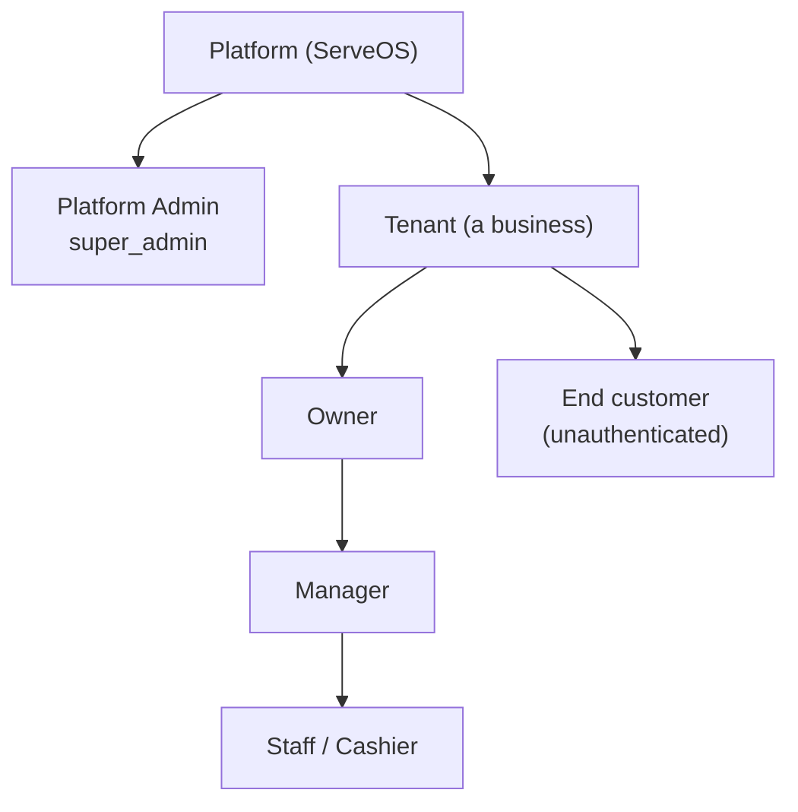
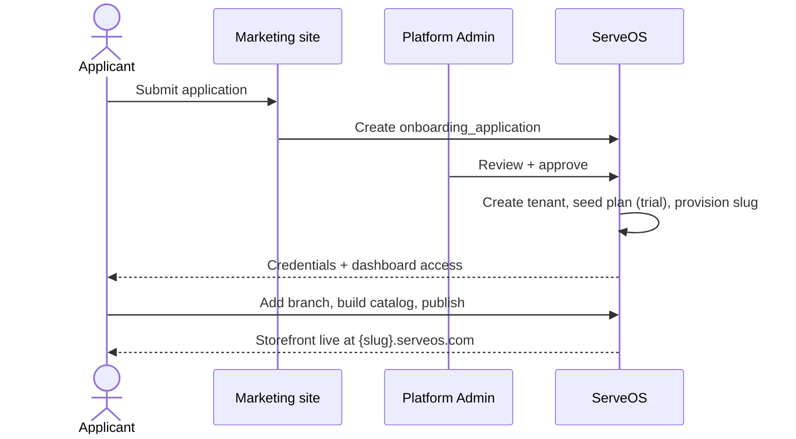
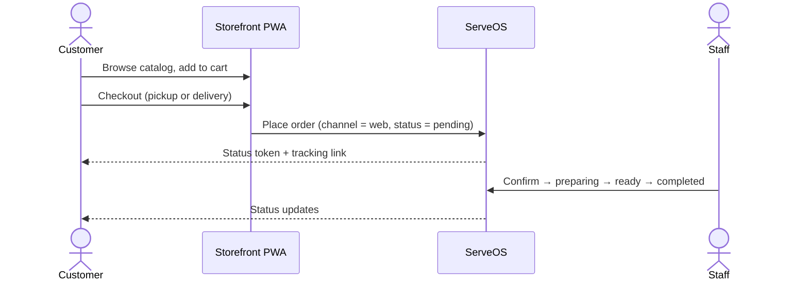
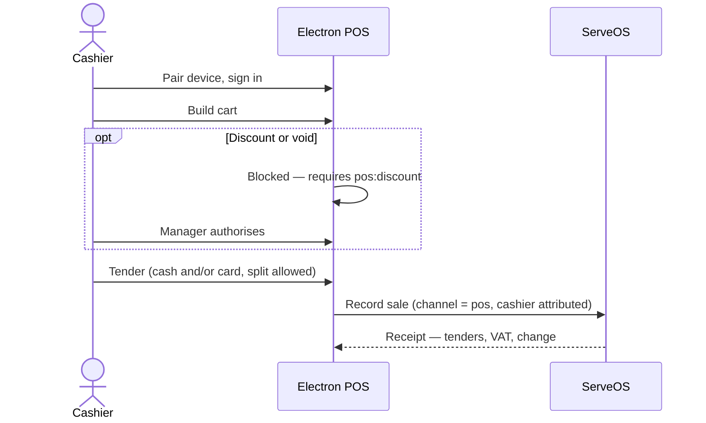
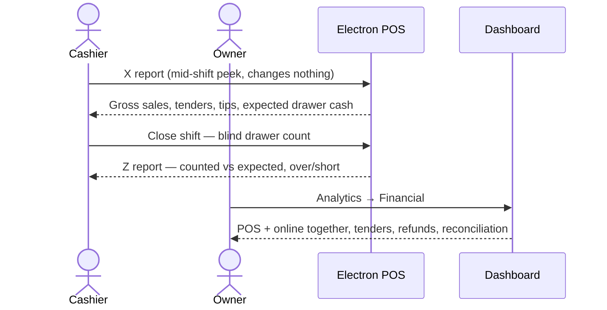
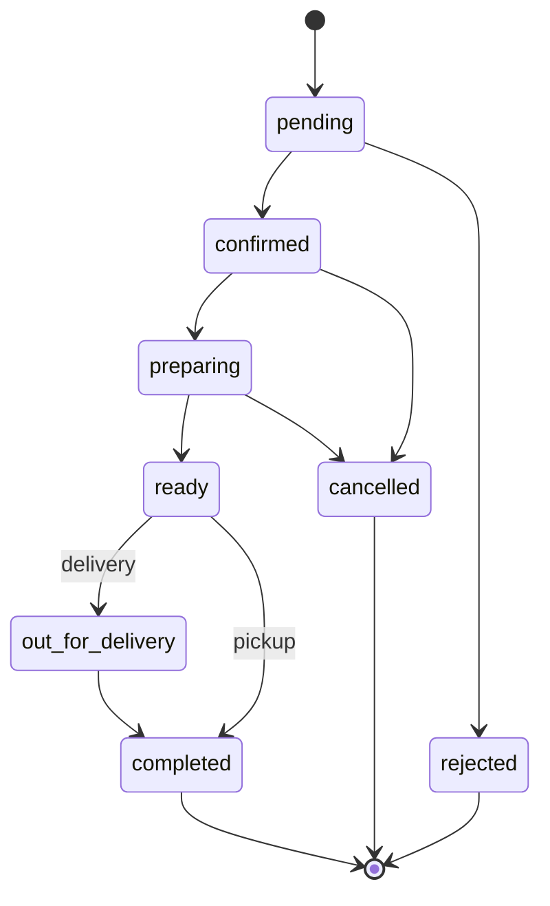
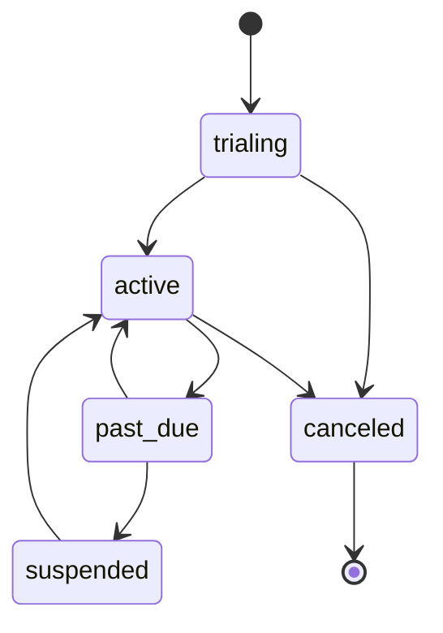
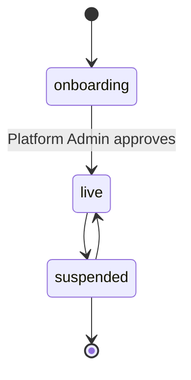

# Product PRD — ServeOS

**Trigger:** Use this when starting a new product, onboarding new team members, or aligning stakeholders on the big picture.
**Output:** A shared mental model — not a ticket list.

**ID:** PRD-001
**Type:** High-Level
**Author:** Mohaned Sayed
**Date:** 2026-07-28
**Status:** Draft — Pending Review
**Target release:** Rolling. Nearest committed increment: Spec 10 (Cross-Channel Reporting) — next sprint.
**Version:** 1.1

## Changelog

| Version | Date | Author | Changes |
|---|---|---|---|
| 1.0 | 2026-07-28 | Mohaned Sayed | Initial draft, reverse-engineered from the shipped codebase, `docs/ROADMAP.md`, and the spec/plan set under `docs/` |
| 1.1 | 2026-07-28 | Mohaned Sayed | Owner confirmations: all four verticals are real and in-market; Saudi Arabia is in scope this year. Open questions 5 and 7 resolved; SA compliance risk added. |

> **Note on provenance:** this PRD was written **after** substantial implementation, by scanning the codebase rather than ahead of it. Sections 6, 10, 12 and 13 describe what exists today and are accurate as of this date. Sections 4, 5 and 17 are the ones most likely to need owner correction — they encode commercial intent that is not derivable from code.

---

## 1. Overview

ServeOS is a multi-tenant SaaS operations platform for small and mid-sized commerce businesses in Egypt and Saudi Arabia. A tenant signs up, is approved, and gets three connected surfaces: an **installable storefront PWA** on their own subdomain for online ordering, a **web dashboard** for running the business, and an **Electron point-of-sale** application for the counter. All three write to one tenant-isolated data store, so a sale rung on the till and an order placed online are the same kind of record.

Although the product began restaurant-first, it now ships as **multi-vertical** — `restaurant`, `retail`, `pharmacy` and `timber`. **All four are real, in-market verticals**, not speculative configuration; each has its own capabilities (modifiers vs. variants/stock), storefront template, and terminology. The commercial model is a three-tier subscription in EGP with usage limits and feature entitlements.

**Both Egypt and Saudi Arabia are in scope this year.** Egypt is the established market; Saudi is a live expansion target. The data model already accepts `SA` as a country, but SA-specific VAT rules, locale handling and fiscal compliance are **not yet specified** — see §17 and §18.

## 2. Problem Statement

Small commerce operators in the region run on a patchwork: a cash register or notebook at the counter, WhatsApp for orders, a spreadsheet for stock, and nothing that connects them. The specific pain:

- **The counter and the internet are separate businesses.** An online order and a walk-in sale live in different systems, so nobody can answer "what did we take today" without manual addition.
- **Cash is unaccountable.** There is no shift, no drawer count, no record of who discounted what. Shrinkage is invisible until it is large.
- **Stock is guesswork.** Nobody knows what is on the shelf, what was wasted, or what was spent with which supplier.
- **Compliance is arriving.** Egypt mandates electronic invoicing and receipts with a signed QR; a paper-and-notebook operation cannot comply.
- **Existing POS software is mis-fitted.** It is priced for Western markets, English-first, assumes card-dominant payment, and does not handle Arabic, EGP, or cash-dominant behaviour well.

## 3. Business Model

**Model type:** B2B2C SaaS — ServeOS sells subscriptions to tenants (businesses); those tenants serve their own end customers through the storefront.

**Role hierarchy:**

**Subscription tiers** (seeded in `plans.seed.ts`, currency EGP):

| Plan | Price/mo | Branches | Staff | Products | Orders/mo | Key features |
|---|---|---|---|---|---|---|
| **Basic** | 0 | 1 | 2 | 50 | 200 | Online ordering only |
| **Pro** | 499 | 3 | 10 | 500 | 2,000 | + WhatsApp, custom theme, reservations |
| **Enterprise** | 1,499 | 50 | 200 | 100,000 | 100,000 | + custom domain, **advanced analytics** |

Revenue is subscription-only today. Billing runs behind a provider interface with a LemonSqueezy variant mapping on the plan record; manual billing is the current path.

## 4. Business Goals

> ⚠️ **Owner input needed** — these are inferred from the roadmap's priorities, not stated anywhere. Correct before this PRD is used for planning.

1. **Convert free tenants to paid.** Basic is free and deliberately thin; Pro and Enterprise are where the business is. Every entitlement-gated capability exists to create that pull.
2. **Make the POS the system of record**, not a satellite. A tenant that rings every sale through ServeOS is one that cannot easily leave.
3. **Win on regional fit** — Arabic-first, EGP, cash-dominant workflows, and ETA compliance — where global POS vendors fit poorly.
4. **Expand horizontally across verticals** using one platform, so a new vertical is a configuration rather than a product. All four current verticals are in-market.
5. **Expand geographically into Saudi Arabia this year**, reusing the same platform with market-specific tax, locale and compliance handling.

## 5. Success Metrics

> ⚠️ **Owner input needed** — no analytics on product usage exist today, so "current" is unmeasured for every row. Instrumenting these is itself a gap.

| Metric | Current | Target |
|---|---|---|
| Free → paid conversion rate | Unmeasured | TBC |
| % of tenant sales rung through the POS (vs. off-system) | Unmeasured | TBC |
| Tenants completing a shift close with a drawer count | 0 (Spec 2 in flight) | TBC |
| Enterprise upgrades citing advanced analytics | Unmeasured | TBC |
| Tenant monthly retention | Unmeasured | TBC |

## 6. User Roles & Permissions

| Role | Description | Key goal |
|---|---|---|
| **Platform Admin** (`super_admin`) | ServeOS staff. Approves tenant applications, suspends tenants, views platform revenue. Operates outside tenant RLS. | Keep the platform healthy and tenants legitimate |
| **Owner** | The business owner. Full control of their tenant including billing and plan changes. | Know the business is running and the money is right |
| **Manager** | Runs a branch or a shift. Everything operational, but not billing or plan changes. | Get through the day without escalating |
| **Staff / Cashier** | Works the till. Sells, manages orders. Cannot discount, void or refund without authorisation. | Ring sales quickly and correctly |
| **End customer** | Unauthenticated storefront visitor. | Order food/goods without friction |

**Permissions matrix** (as shipped, `src/server/rbac/permissions.ts`):

| Action | Owner | Manager | Staff | Platform Admin |
|---|---|---|---|---|
| `tenant:manage` | ✅ | — | — | — |
| `staff:invite` | ✅ | ✅ | — | — |
| `plan:view` | ✅ | ✅ | ✅ | — |
| `plan:change` / `billing:manage` | ✅ | — | — | — |
| `menu:manage` | ✅ | ✅ | — | — |
| `orders:manage` / `fulfillment:manage` | ✅ | ✅ | ✅ (orders only) | — |
| `payments:confirm` | ✅ | ✅ | — | — |
| `pos:sell` | ✅ | ✅ | ✅ | — |
| `pos:discount` / `pos:void` / `pos:refund` | ✅ | ✅ | — | — |
| `audit:view` / `reconciliation:manage` | ✅ | ✅ | — | — |
| `platform:*` | — | — | — | ✅ |

**Planned additions** (Spec 10 / Epic #28): `reports:view` and `reports:financial`, both Owner + Manager. `reports:financial` is the first permission that a Manager may hold **separately** from operational access — it is what lets an owner delegate day-to-day reporting without exposing the day's take.

## 7. Core User Journeys

### 7.1 Tenant onboarding

A business applies, a Platform Admin approves, and the tenant gets a live storefront on `{slug}.serveos.com`.

### 7.2 Online order (storefront → fulfilment)

### 7.3 Counter sale (POS)

### 7.4 Close of day *(target state — Specs 2 + 10)*

## 8. Solution Overview

1. **Multi-tenant core** — tenancy with Postgres FORCE Row-Level Security, self-hosted auth, RBAC, plans and entitlements, manual billing behind a provider interface.
2. **Per-tenant storefront PWA** — installable, branded, host-routed on `{slug}.serveos.com`, with vertical-specific templates and terminology.
3. **Web dashboard** — catalog, branches, orders, fulfilment, settings, billing, and reporting.
4. **Electron POS** — device pairing, cashier sign-in, cart, split tender, discounts/voids with manager authorisation, held tickets; shifts and cash drawer in flight.
5. **Operations layer** *(roadmap)* — tamper-evident audit log, payments gateway, reconciliation, inventory with recipe-level deduction, suppliers and purchasing.
6. **Cross-channel reporting** *(Spec 10, Epic #28)* — one reporting layer over both channels on the dashboard, plus operational X/Z reports on the POS.
7. **Fiscal compliance** *(Spec 11)* — ETA e-invoicing and e-receipts with signed QR.

## 9. Business Rules

- **Tenant isolation is absolute.** Every tenant-scoped table carries `tenant_id` with FORCE RLS, enforced through the `withTenant()` transaction wrapper. The database role is `NOBYPASSRLS`. A tenant can never read another tenant's data, including via reporting.
- **Plan limits are enforced at the boundary**, through a single entitlements service — not scattered through feature code.
- **Feature entitlements gate capability, permissions gate people.** A user needs both: their role must allow the action *and* the tenant's plan must include the feature.
- **Money-sensitive data is omitted server-side, never hidden client-side.** A user without the permission must not receive the figures at all.
- **A cashier cannot discount, void or refund unaided** — those require `pos:discount` / `pos:void` / `pos:refund`, i.e. manager authorisation at the till.
- **All day-bucketing uses the tenant's timezone**, not UTC. A 01:00 sale belongs to the correct business day.
- **Revenue excludes cancelled and rejected orders** *(decision pending in issue #31 — currently violated in shipped code)*.
- **Device scoping on the POS.** A signed-in cashier's reads are scoped to their device and branch; till 1 cannot read till 2.

## 10. Status Flows

### 10.1 Order status flow

### 10.2 Subscription status flow

### 10.3 Tenant status flow

**Cross-platform status mapping:**

| Status | Dashboard | Storefront | POS | API value |
|---|---|---|---|---|
| Pending | Pending | Order received | — | `pending` |
| Confirmed | Confirmed | Confirmed | — | `confirmed` |
| Preparing | Preparing | Being prepared | Queue | `preparing` |
| Ready | Ready | Ready for pickup | Queue | `ready` |
| Out for delivery | Out for delivery | On the way | — | `out_for_delivery` |
| Completed | Completed | Completed | Sale complete | `completed` |
| Rejected | Rejected | Could not be accepted | — | `rejected` |
| Cancelled | Cancelled | Cancelled | Voided | `cancelled` |

> Labels are indicative — `src/lib/order-status.ts` (`orderStatusMeta`) is the single source of truth for labels and colours. Keep them in sync.

## 11. Design

**Host-based routing** (`src/proxy.ts`):

| Host | Surface |
|---|---|
| `{slug}.serveos.com` | Tenant storefront PWA (installable) |
| `app.serveos.com` | Restaurant/business dashboard |
| `admin.serveos.com` | Platform admin approval queue |
| bare root | Marketing site |

Local development uses `.localhost` equivalents.

**Dashboard navigation:** Home · Analytics · Orders · Menu/Products · Branches · Banners · Settings (incl. Billing).

**POS screens:** pairing → cashier sign-in → sale/cart → payment → orders queue → held tickets. Reports (X/Z) and drawer screens are planned.

**Figma:** ⚠️ **None.** There is no design file for any surface. Brand identity exists as concept assets (`Serve OS Brand Identity Concepts/`) and brand-identity design docs under `docs/adham-ai/specs/`. **This is a standing gap** — six upcoming surfaces in Epic #28 alone have no design reference.

## 12. Macro Data Model

**Tenancy & identity**
- **Tenant** — the business. Carries slug, country (`EG`/`SA`), currency, locale, timezone, vertical, branding. Root of all isolation.
- **TenantSettings** — free-form JSONB per-tenant configuration.
- **User / Session / Role / UserRole** — self-hosted auth and role assignment.

**Commercial**
- **Plan** — tier with JSONB `limits` and `features`. **Subscription** — a tenant's plan with lifecycle status. **UsageCounter** — metered usage per period. **Invoice** — billing record.
- **OnboardingApplication** — pre-tenant application awaiting approval.

**Catalog & locations**
- **Branch** — a physical location. **DeliveryArea** — deliverable zones per branch.
- **Category → Product → ProductVariant**; **ModifierGroup → ModifierOption** (restaurant); **BranchProductAvailability** — per-branch stock/visibility.

**Ordering**
- **Order** — the central record. Carries `channel` (`web`|`pos`), `branchId`, `cashierUserId`, `status`, `fulfillmentType`, `paymentStatus`, and the money columns (`subtotal`, `vatAmount`, `serviceChargeAmount`, `deliveryFee`, `discountAmount`, `total`). **This single table spanning both channels is what makes cross-channel reporting a query rather than an integration.**
- **OrderItem** — line items with name snapshots. **OrderStatusEvent** — status transition history.

**POS**
- **PosDevice / PosPairingCode** — device registration. **PosOrderReceipt** — receipt records.
- **OrderPayment** — tenders: method, amount, tip, tendered, change, taken-by. **PosAdjustmentEvent** — discounts and voids with reason codes.
- **PosShift / CashCount** — shift sessions and drawer counts *(in flight, `feat/shifts-cash-drawer`)*.

**Audit**
- **AuditEvent / AuditChainHead** — append-only, hash-chained tenant audit log. **AuditLog** — platform-level.

**Planned** *(roadmap, not yet migrated)*: refunds; settlement batches; reconciliation runs/exceptions; inventory items, lots, stock ledger, stock counts, storage locations; suppliers, purchase orders, PO receipts.

## 13. Integration Points

| System | Purpose | Status |
|---|---|---|
| **Supabase Postgres** | Primary datastore; RLS enforcement | Live |
| **Vercel** | Hosting for the Next.js surfaces | Live |
| **LemonSqueezy** | Subscription billing (variant ID on plan) | Interface in place; manual billing is the current path |
| **Resend** | Transactional/outbound email, behind an `EmailProvider` interface | Decided (D7); needs verified sending domain + DNS |
| **WhatsApp** | Tenant customer messaging | Plan feature flag exists; entitlement-gated |
| **Payment gateway (Paymob)** | Online card payments + settlement | ⏸ **PARKED** — provider decision open |
| **Egyptian Tax Authority (ETA)** | E-invoicing / e-receipts with signed QR | Spec 11, not built |

## 14. Non-Functional Requirements

- **Tenant isolation** — FORCE RLS on every tenant table, `NOBYPASSRLS` DB role, isolation asserted by test for each new table. This is the product's core security property.
- **Localisation** — Arabic default locale with RTL, English secondary. EGP default currency; `Africa/Cairo` default timezone.
- **Offline resilience** — ⚠️ the POS is **online-first and fails hard on network loss**. `apps/pos/electron/_offline/` is parked. The roadmap names this the highest operational priority in the backlog.
- **Auditability** — hash-chained, append-only audit events; sensitive actions (discounts, voids, refunds) are attributed to a user.
- **Reporting performance** — on-the-fly aggregation is the shipped strategy; a 365-day live query is acceptable. Nightly rollups are specced as a deferred escape hatch.
- **Compliance** — ETA e-invoicing is a legal requirement in Egypt, not a feature.

## 15. Scope

### In scope
- Multi-tenant core: tenancy, RLS, auth, RBAC, plans, entitlements, billing interface, onboarding with admin approval
- Per-tenant installable storefront PWA across **all four in-market verticals** (restaurant, retail, pharmacy, timber)
- **Egypt and Saudi Arabia** as target markets this year, including SA-specific VAT, locale and fiscal compliance (to be specified)
- Web dashboard: catalog, branches, orders, fulfilment, banners, settings, billing, analytics
- Electron POS: pairing, cashier auth, sale and tender, discounts/voids with authorisation, held tickets, shifts and cash drawer
- Operations roadmap: audit log, notifications/email, payments, reconciliation, inventory + recipes, suppliers + purchasing, cross-channel reporting
- Fiscal compliance: ETA e-invoicing and e-receipts

### Out of scope
- Native mobile apps (the storefront is a PWA)
- Dine-in table management, floor plans, seat/course assignment
- Kitchen Display System and kitchen printing
- Peripheral hardware: ESC/POS printers, cash-drawer kick, barcode scanners, scales, customer displays
- Loyalty, store credit, gift cards
- Promotions and combos engine beyond manual line/order discounts
- Staff time clock, tip pooling, labour reporting
- Delivery dispatch and driver tracking
- Platform-level cross-tenant analytics beyond the existing admin view
- Multi-currency within a single tenant

## 16. Dependencies

- **Payment gateway decision** — Specs 6 and 7's settlement layer is blocked on the owner choosing a provider.
- **Resend sending domain + DNS records** — needed from the owner before Spec 5's outbound email can ship.
- **ETA integration requirements** — mandate scope and thresholds to be verified during Spec 11.
- **Spec sequencing** — `docs/ROADMAP.md` defines the dependency graph across Specs 1–11. Spec 10 (reporting) sits at the end and depends on 2, 3, 6, 7, 8 and 9.
- **Design capacity** — no Figma exists; every upcoming surface currently ships design-less.

## 17. Risks

| Risk | Likelihood | Impact | Mitigation |
|---|---|---|---|
| POS fails during an internet outage; tenant cannot sell | High | Critical | Offline-first resilience is the top backlog item; prioritise it |
| ETA compliance deadline missed | Medium | Critical | Spec 11 promoted out of backlog and numbered |
| Payment gateway decision stays parked, blocking reconciliation | Medium | High | Cash + integrity reconciliation layers built independently of the gateway |
| Reporting definitions inconsistent across surfaces (revenue means different things) | High | High | Issue #31 — write `reporting-metrics.md` and fix the shipped aggregations |
| Six upcoming surfaces built without design | High | Medium | Flagged per-issue; needs a design decision, not an engineering one |
| No product usage instrumentation, so success metrics are unmeasurable | High | Medium | Instrument before setting targets in §5 |
| **Saudi launch this year with no SA tax/compliance spec.** The schema accepts `SA`, but VAT rate handling, ZATCA e-invoicing (the SA analogue of ETA), Arabic locale variance and SAR currency are unspecified and unbuilt | High | High | Scope an SA market-readiness spec now; it is a prerequisite for launch, not a follow-up. Note ETA (Spec 11) is Egypt-only and does **not** cover Saudi |
| Currency is effectively single (EGP default, plan prices EGP-only) while a second market launches | High | Medium | Confirm whether SA tenants are billed in SAR or EGP; plan pricing is currently EGP-only in `plans.seed.ts` |
| Building Spec 10 ahead of its dependencies leaves dormant code | Medium | Low | `tableExists` guard (#30) makes degradation explicit and tested |

## 18. Open Questions

1. **Payment gateway** — ⏸ parked with the owner. Blocks Specs 6/7 settlement.
2. **Integrated card terminals vs. record-only card tenders** — parked; specs default to record-only.
3. **Commercial targets** — §4 and §5 are inferred. What are the actual conversion, retention and ARPU goals?
4. **Design ownership** — who produces Figma for the dashboard reporting pages and POS report/drawer screens, and when?
5. ✅ **RESOLVED (2026-07-28)** — **Saudi Arabia is in scope this year.** Follow-on questions this opens, now the blocking ones: what is the SA VAT rate and its handling versus Egypt's? Does ZATCA e-invoicing apply, and on what timeline? Are SA tenants billed in SAR or EGP (plan prices are EGP-only today)? Is Saudi Arabic locale handling different enough to need its own treatment? **An SA market-readiness spec does not exist and is a launch prerequisite.**
6. **Revenue definition** — cancelled/rejected exclusion is decided in #31; does the owner also want a net-of-VAT measure alongside gross? This gains weight with two VAT regimes in play.
7. ✅ **RESOLVED (2026-07-28)** — **all four verticals are real and in-market.** None is speculative. Follow-on: does each vertical need its own feature roadmap, or do they share one?

## 19. Glossary

| Term | Definition |
|---|---|
| **Tenant** | A business customer of ServeOS. The unit of data isolation and billing. |
| **Vertical** | The business type a tenant operates: `restaurant`, `retail`, `pharmacy`, `timber`. Determines capabilities, storefront template and terminology. |
| **Channel** | Where an order originated: `web` (storefront) or `pos` (counter). A column on `orders`. |
| **RLS** | Row-Level Security. Postgres enforcement that a query only returns rows for the active tenant. |
| **`withTenant()`** | The transaction wrapper that sets tenant context so RLS applies. All tenant-scoped queries go through it. |
| **Entitlement** | A plan-level capability flag (e.g. `advanced_analytics`) gating whether a tenant's subscription includes a feature. |
| **Permission** | A role-level grant (e.g. `reports:financial`) gating whether a *person* may perform an action. Distinct from an entitlement. |
| **Tender** | A payment applied to an order: method, amount, tip, tendered and change. An order may have several. |
| **Void** | Cancelling a line or an order at the till before completion. Distinct from a refund. |
| **Refund** | Returning money after a sale completed. Owned by Spec 3, not yet built. |
| **X report** | A mid-shift POS snapshot. Non-resetting, repeatable, changes nothing. A peek. |
| **Z report** | The POS shift-close report. Freezes totals, includes blind over/short, one immutable snapshot per shift. |
| **Blind count** | Counting the drawer without seeing the expected figure first, so the count is not anchored. |
| **Over/short** | The variance between counted drawer cash and expected drawer cash. |
| **Held ticket** | A parked POS cart, recalled later. A partial stand-in for table tabs. |
| **ETA** | Egyptian Tax Authority. Mandates electronic invoicing/receipts with a signed QR. |
| **Spec N** | A numbered technical design in `docs/ROADMAP.md`, each with a design doc and implementation plan under `docs/`. |
