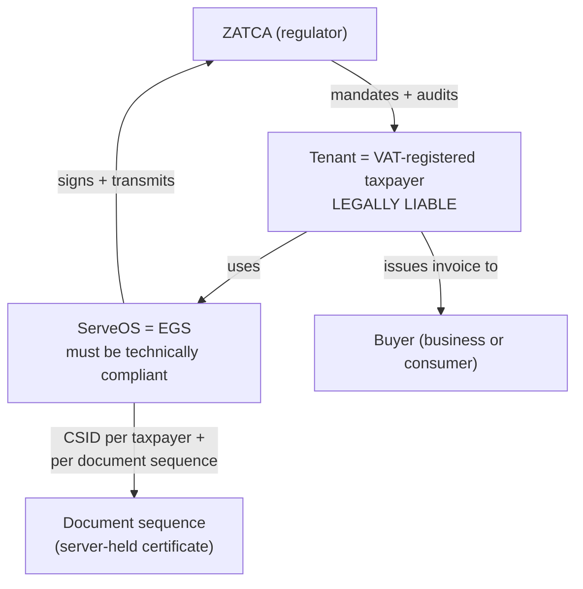
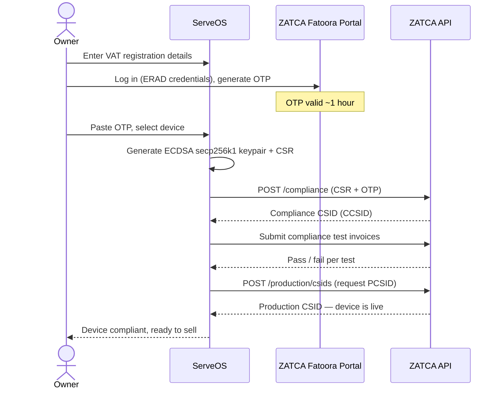
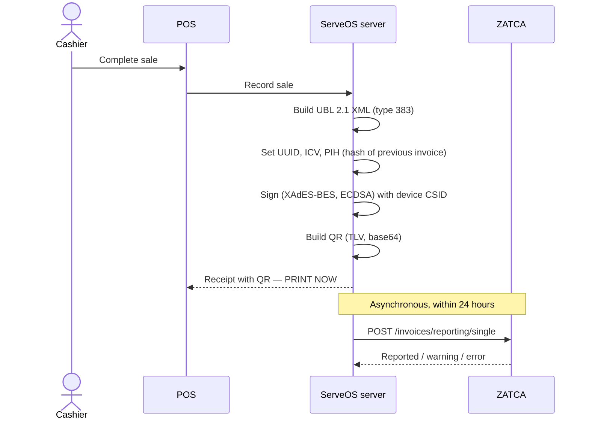
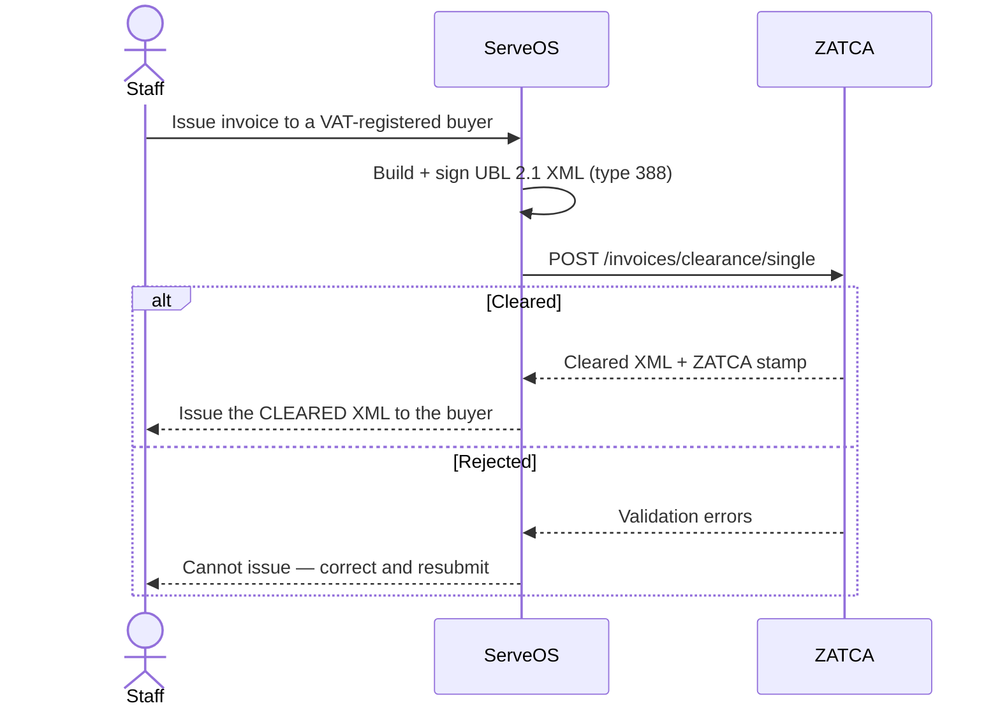
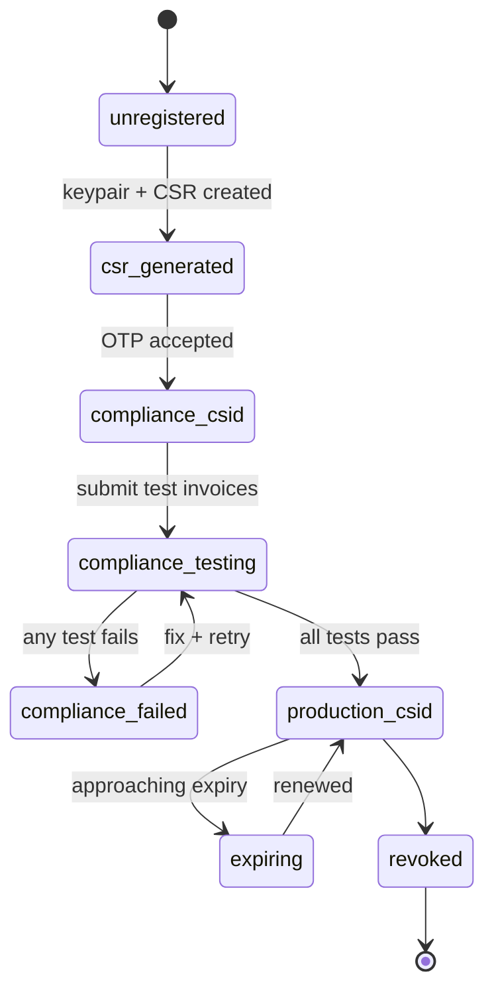
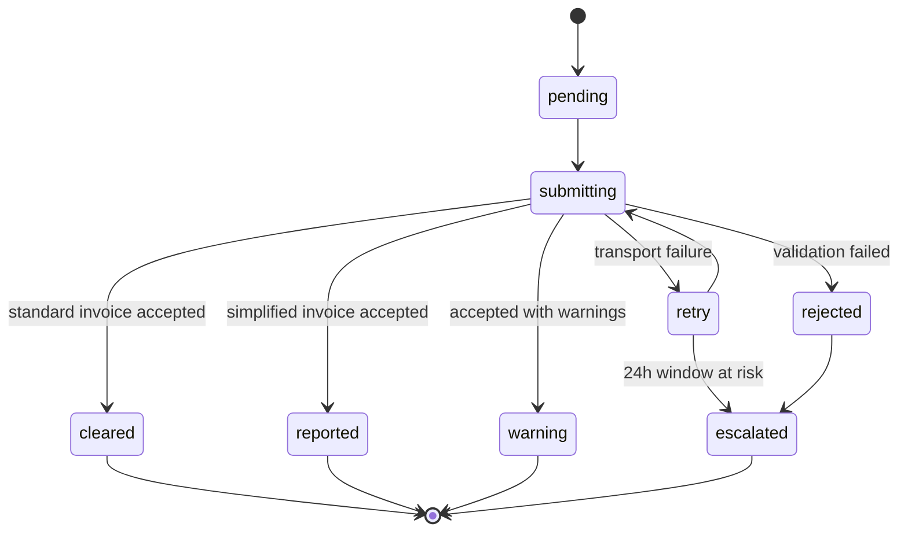

# Product PRD — ZATCA E-Invoicing Compliance (Saudi Arabia)

**Trigger:** Use this when starting a new product, onboarding new team members, or aligning stakeholders on the big picture.
**Output:** A shared mental model — not a ticket list.

**ID:** PRD-003
**Type:** High-Level
**Parent PRD:** [PRD-001 — ServeOS](prd-high-serveos.md)
**Author:** Mohaned Sayed
**Date:** 2026-07-28
**Status:** Draft — Pending Review
**Target release:** Phase 1 + Phase 2 readiness before the **first Saudi tenant goes live**. Hard external deadline: **1 February 2027** (Wave 25).
**Version:** 1.2

## Changelog

| Version | Date | Author | Changes |
|---|---|---|---|
| 1.0 | 2026-07-28 | Mohaned Sayed | Initial draft from ZATCA research (see Appendix D for sources and confidence levels) |
| 1.1 | 2026-07-28 | Mohaned Sayed | **Verified against ZATCA's official Detailed Technical Guidelines (v2, Nov 2022) after extracting the PDF.** Major correction: CSID is **not** necessarily per-device — for a centralised cloud architecture like ServeOS it is per-taxpayer plus per-document-sequence, and dumb POS terminals need no certificate. QR code has **9** tags, not 8. Added: ICV must never be reused (rejected documents get a new UUID/ICV/hash), PDH is maintained across rejections, ZATCA does not stamp simplified documents, the offline SDK validator, exact CSR fields, EGS serial format, and revocation triggers. Most Appendix A/B items upgraded from ○ to ⭐. |
| 1.2 | 2026-07-28 | Mohaned Sayed | **Read the XML Implementation Standard v1.2 and the Electronic Invoice Data Dictionary.** New Appendix C (UBL document structure). **Second major correction: invoice type codes.** `383` is a *debit note*, not a simplified invoice — the standard/simplified split lives in the `InvoiceTypeCode/@name` subtype, not the code. Added VAT category codes (S/Z/E/O) with `VATEX-SA-*` exemption reasons, half-up rounding rules, and the concrete field counts (**50 mandatory + 62 conditional** for a simplified invoice). **New schema gap found:** seller address is fully mandatory (street, building number, city, postal code, district, country) and `branches` cannot represent it. |

---

> ## ⚠️ Read this before anything else
>
> **1. This is not a feature. It is a licence to operate.** Without ZATCA compliance, ServeOS cannot legally be sold to any VAT-registered business in Saudi Arabia. PRD-001 puts Saudi in scope this year; this document is the cost of that decision.
>
> **2. Wave 25 was announced on 27 July 2026 — yesterday.** The threshold dropped to **SAR 187,500** of VAT-subject revenue in *any* year from 2022–2025, with an integration deadline of **1 February 2027**. At that threshold, effectively **every ServeOS-sized tenant in Saudi is in scope**. There is no "too small to matter" segment left.
>
> **3. Verification status (updated v1.1).** The technical content has now been **verified directly against ZATCA's official *E-invoicing Detailed Technical Guidelines* (Version 2, November 2022)**, extracted from the published PDF. Signing, QR/TLV, chaining, onboarding, revocation, and the reporting/clearance models are primary-sourced (⭐). Still third-party-sourced (○) and requiring confirmation: **prohibited functions, archiving/retention, data residency, and penalties** — these live in the *E-Invoicing Regulation* and the *Controls, Requirements, Technical Specifications and Procedural Rules* (the Resolution), which were not retrieved. API endpoint paths also remain third-party.
>
> **4. The architecture assumption in v1.0 was wrong.** v1.0 stated "one certificate per POS device" as an absolute. ZATCA §3.5 is explicit that this depends on deployment topology — and for ServeOS's centralised cloud model, **the certificate belongs on the server, not the tills**. See §9 and Appendix A.10. This materially reduces scope.

---

## 1. Overview

ZATCA (the Zakat, Tax and Customs Authority) mandates electronic invoicing — *Fatoora* — for all VAT-registered businesses in Saudi Arabia. Compliance has two phases: **Generation** (issue structured, tamper-resistant e-invoices with a QR code) and **Integration** (cryptographically sign every invoice with a ZATCA-issued certificate and transmit it to ZATCA's platform, in real time for B2B and within 24 hours for B2C).

This initiative makes ServeOS a compliant **E-Invoice Generating Solution (EGS)** so that Saudi tenants can legally transact. It touches the POS, the storefront, the dashboard, the data model, and — critically — the hosting architecture.

It is the Saudi counterpart to Spec 11 (Egypt's ETA e-invoicing). **The two share one abstraction**: Spec 11 already defines a `FiscalProvider` interface with a `NoopFiscalProvider` and a resolver. ZATCA is a second implementation behind that same interface, not a parallel system.

## 2. Problem Statement

ServeOS today cannot be sold to a VAT-registered Saudi business. Specifically:

- **No fiscal capability for Saudi.** Invoices are plain database rows plus a rendered receipt. There is no UBL 2.1 XML, no cryptographic stamp, no ZATCA QR, no transmission to any authority.
- **The addressable market is effectively 100% in scope.** With Wave 25 at SAR 187,500, the small merchants ServeOS targets are captured. A non-compliant POS is unsellable, not merely less attractive.
- **Penalties fall on the tenant, but the fault is the vendor's.** A merchant using non-compliant software faces fines from SAR 1,000 up to SAR 50,000. They will hold ServeOS responsible, and rightly.
- **Two product behaviours are currently non-compliant.** ZATCA prohibits deleting or amending an invoice after issuance — a POS that merely *offers* the capability is in violation. ServeOS's `order_void` and `line_void` adjustments need examination against this, and refunds must become credit notes.
- **Hosting may be disqualifying.** E-invoice records must be retained for six years on servers inside Saudi Arabia, and the PDPL constrains where Saudi residents' personal data may live. ServeOS runs on Supabase and Vercel with no confirmed KSA region.

## 3. Business Model

**Model type:** B2B2B compliance enablement — ServeOS acts as the EGS on behalf of its tenants, who remain the legally liable taxpayers.

**Who is liable for what:**



**The liability split matters commercially.** The *tenant* is fined, not ServeOS. But a tenant fined because of ServeOS's software will churn and may seek recovery. Compliance is therefore both a market-access requirement and a liability-management one — the terms of service should address it explicitly.

**Commercial positioning:** ZATCA compliance is a **baseline capability, not a paid tier.** Gating legal compliance behind an upgrade would make the Basic plan unsellable in Saudi and is likely indefensible. This differs from `advanced_analytics` and needs an explicit pricing decision (see §18).

## 4. Business Goals

1. **Unlock the Saudi market.** Compliance is the entry condition for every VAT-registered prospect.
2. **Protect tenants from penalties** by making the compliant path the only path — no configuration a merchant can get wrong.
3. **Reuse the fiscal abstraction** built for Egypt so a third market is incremental, not another full build.
4. **Turn compliance into a sales asset.** "ZATCA Phase 2 ready" is a checkbox every Saudi buyer screens on, and many competitors handle it poorly.

## 5. Success Metrics

| Metric | Current | Target |
|---|---|---|
| ZATCA compliance certification passed (sandbox → simulation → production) | Not started | Passed before first Saudi tenant onboards |
| Saudi tenants able to onboard a device and obtain a Production CSID | 0 | 100% of Saudi tenants, self-service |
| Simplified invoices reported to ZATCA within the 24-hour window | N/A | ≥ 99.9% |
| Standard invoices cleared before issuance | N/A | 100% (a failed clearance must block issuance) |
| Tenant-reported ZATCA penalties attributable to ServeOS | N/A | **Zero** |
| Invoice records retained ≥ 6 years in KSA, XML + PDF/A-3 | Not met | 100% |

## 6. User Roles & Permissions

| Role | Description | Key goal |
|---|---|---|
| **Owner** | The VAT-registered taxpayer. Legally liable. Supplies the VAT number, generates the OTP on ZATCA's Fatoora portal, authorises device onboarding. | Be compliant without becoming a cryptography expert |
| **Manager** | Runs branches. May onboard and monitor devices; sees submission health. | Keep tills issuing valid invoices |
| **Cashier** | Rings sales. Should never see ZATCA mechanics — a compliant receipt is simply what prints. | Serve the customer |
| **Platform Admin** | ServeOS staff. Monitors fleet-wide submission health and certificate expiry. | Catch systemic failures before tenants are fined |
| **ZATCA** | External regulator. Issues certificates, validates, clears, audits. | Tax integrity |

**Permissions matrix:**

| Action | Owner | Manager | Cashier | Platform Admin |
|---|---|---|---|---|
| Enter/maintain VAT registration details | ✅ | — | — | — |
| Generate OTP + onboard a device (obtain CSID) | ✅ | ✅ | — | — |
| View device certificate status / expiry | ✅ | ✅ | — | ✅ |
| Revoke or renew a device certificate | ✅ | — | — | ✅ |
| View submission queue / failures | ✅ | ✅ | — | ✅ |
| Retry a failed submission | ✅ | ✅ | — | ✅ |
| Issue an invoice (implicitly, by selling) | ✅ | ✅ | ✅ | — |
| Issue a credit/debit note (correction) | ✅ | ✅ | — | — |
| **Delete or amend an issued invoice** | ❌ | ❌ | ❌ | ❌ |

The last row is a **regulatory prohibition, not a permission choice.** No role may hold it, and the capability must not exist in the software.

**Proposed new permission:** `fiscal:manage` — already named in Spec 11's plan (Task 6). Reuse it rather than inventing a ZATCA-specific one.

## 7. Core User Journeys

### 7.1 Tenant onboards a POS device and obtains a certificate

The highest-risk journey — it involves the tenant leaving ServeOS to fetch an OTP from ZATCA's portal, and it must be survivable by a non-technical merchant.



### 7.2 Cashier issues a simplified (B2C) invoice — the common case

The dominant POS path. Note it does **not** block the sale: sign locally, print immediately, report within 24 hours.



### 7.3 Standard (B2B) invoice — clearance blocks issuance

The inverse: ZATCA must clear the invoice **before** it is legally issued, and only the cleared XML is the legal document.



### 7.4 Correcting a mistake — credit note, never deletion

```mermaid
sequenceDiagram
    actor Manager
    participant ServeOS
    participant ZATCA
    Manager->>ServeOS: Customer returns an item
    Note over ServeOS: Deleting/amending the original is PROHIBITED
    ServeOS->>ServeOS: Create credit note referencing original invoice
    ServeOS->>ServeOS: Sign, chain (PIH), assign new ICV
    ServeOS->>ZATCA: Report or clear per invoice type
    ServeOS-->>Manager: Credit note issued; original untouched
```

## 8. Solution Overview

1. **Fiscal provider implementation** — a `ZatcaFiscalProvider` behind Spec 11's existing `FiscalProvider` interface, resolved per tenant by country. Egypt gets `EtaFiscalProvider`, Saudi gets `ZatcaFiscalProvider`, everyone else `NoopFiscalProvider`.
2. **Certificate lifecycle** — CSR generation, OTP-based compliance onboarding, compliance test execution, production certificate issuance, renewal and revocation. Keyed to the **document sequence** (server-side), not to `pos_devices`.
3. **Invoice document builder** — UBL 2.1 XML generation with correct type codes, tax categories, and the invoice chain (UUID, ICV, PIH).
4. **Cryptographic signing service** — XAdES-BES signature with the device's private key, plus TLV QR generation.
5. **Submission pipeline** — asynchronous reporting for simplified invoices with retry inside the 24-hour window; synchronous clearance for standard invoices that blocks issuance on failure.
6. **Compliant archive** — six-year retention of XML and PDF/A-3, on infrastructure inside Saudi Arabia.
7. **Tenant-facing compliance surface** — device certificate status, submission health, failure remediation.

## 9. Business Rules

These are regulatory constraints the system **must** enforce. Full catalogue in Appendix A.

- **Simplified vs standard determines the flow.** Both are type code `388`; the distinction is the subtype in `InvoiceTypeCode/@name` — `02` simplified (B2C), `01` standard (B2B/B2G). Simplified invoices are signed locally, given to the customer immediately, and reported to ZATCA **within 24 hours**. Standard invoices must be **cleared by ZATCA before issuance**; only the cleared XML is the legal tax document. See Appendix A.4.
- **Certificate placement follows deployment topology — not "one per till".** ZATCA §3.5 defines four scenarios. ServeOS is a **centralised cloud server** (scenario 3.5.1) where the Electron POS submits sales to the ServeOS server and the server records, signs and returns the receipt. That means: **one CSID per taxpayer, plus one CSID per unique sequence of generated documents**, held on the server. Under scenario 3.5.4, dumb terminals that cannot sign need **no** certificate at all, provided the server stamps and applies the QR *before the invoice is presented to the customer* — which is exactly ServeOS's flow. **The tills do not need certificates.** See Appendix A.10.
- **The real design question is how many document sequences a tenant has.** One CSID is required per unique document sequence, and each sequence carries its own ICV counter and PDH chain. Per tenant, per branch, or per till is an open architectural decision (§18 Q10) with direct cost and concurrency consequences.
- **Invoices are immutable once issued.** Deleting or amending is prohibited. A POS that *offers* the capability is itself a violation. Corrections are credit or debit notes referencing the original.
- **Every invoice is chained.** Each carries the SHA-256 hash of the previous invoice (PIH) and a monotonic counter (ICV), so a deleted invoice is detectable.
- **Every simplified invoice carries a compliant QR code** encoding seller, VAT number, timestamp, totals, hash, signature and public key.
- **Records are retained six years, inside Saudi Arabia**, as XML plus PDF/A-3, and must stay retrievable throughout.
- **VAT registration is a precondition.** A Saudi tenant cannot issue compliant invoices without a valid VAT number on file.
- **Sandbox certificates never work in production.** Environments are strictly separated.
- **A failed clearance blocks issuance; a failed report does not block the sale** — but must be retried within the window and escalated if it cannot be.

## 10. Status Flows

### 10.1 Device certificate (CSID) lifecycle



### 10.2 Fiscal submission lifecycle



**Cross-platform status mapping:**

| Status | Dashboard | POS | API value |
|---|---|---|---|
| Pending | Queued | — | `pending` |
| Reported | Reported to ZATCA | ✓ | `reported` |
| Cleared | Cleared by ZATCA | ✓ | `cleared` |
| Warning | Accepted with warnings | ✓ | `warning` |
| Rejected | Rejected — action needed | ⚠ | `rejected` |
| Escalated | Needs attention | ⚠ | `escalated` |

## 11. Design

**Dashboard — new "Compliance" area under Settings:**
- Tax registration (VAT number, ZATCA environment)
- Certificates — per document sequence: status, expiry, onboarding and renewal actions, revocation
- Submission health — queue depth, failures, retry, 24-hour window warnings

**POS:**
- Onboarding is a **dashboard** activity, not a till activity — a cashier must never handle an OTP or CSR.
- The receipt gains the ZATCA QR code. Otherwise the cashier's experience is unchanged.
- If a device's certificate is expired or missing, the POS must warn **before** a sale, not fail after.

**Figma:** ⚠️ **None** — consistent with every other ServeOS surface. The certificate-onboarding flow is the most design-sensitive screen in the product to date: a non-technical merchant must move between ZATCA's portal and ServeOS carrying a one-hour OTP without losing their way.

## 12. Macro Data Model

Reuse Spec 11's shapes where possible rather than inventing Saudi-specific twins.

- **`fiscal_tenant_config`** *(generalise Spec 11's `eta_tenant_config`)* — per-tenant: VAT registration number, legal name in Arabic and English, address, environment (sandbox/simulation/production), provider (`eta` | `zatca` | `noop`).
- **`fiscal_certificates`** *(new)* — **one row per document sequence**, not per till: CSR, encrypted private key, compliance CSID, production CSID, secret, EGS serial number, invoice-type functionality map, status, issued/expiry/revoked timestamps. **The most security-sensitive table in the product** — it holds signing keys.
- **`fiscal_document_sequences`** *(new)* — the unit a certificate is issued against. Scope (tenant / branch / device) is the open decision in §18 Q10.
- **`fiscal_submissions`** *(generalise Spec 11's `eta_submissions`)* — one row per invoice/note: document type, UUID, ICV, PIH, invoice hash, signed XML, QR payload, submission status, ZATCA response, retry count, timestamps.
- **`fiscal_document_chain`** *(new, or a column set on the sequence)* — per **document sequence**: last ICV and last document hash (PDH), so the next document chains correctly. Must be concurrency-safe — two simultaneous sales in the same sequence must not receive the same ICV. **An ICV is never reused, even after a rejection.**
- **`product_tax_codes`** *(from Spec 11)* — tax category per product. ZATCA requires a VAT category code (`S`/`Z`/`E`/`O`) per line, **plus a `VATEX-SA-*` exemption reason code with Arabic text** wherever the category is `Z` or `E`. Spec 11's shape must accommodate the reason code, not just the rate.
- **`branches` needs a structured Saudi address** *(schema change)* — ZATCA mandates street, building number, city, postal code, district and country on **every** invoice including simplified. The current `branches` table cannot represent this. See Appendix C.2.
- **Existing, reused:** `orders` (the invoice source), `pos_devices` (maps to a sequence, but holds **no** certificate under the centralised model), `branches` (a plausible sequence boundary), `tenants` (country drives provider selection), `audit_events` (Spec 4's hash chain — structurally similar to the PDH chain but a **different chain for a different purpose**; do not conflate them).

## 13. Integration Points

| System | Purpose | Notes |
|---|---|---|
| **ZATCA Fatoora Portal** | Tenant-facing: OTP generation, CSID management, device list, revocation | Tenant logs in with ERAD credentials + MFA. Manual step in an otherwise automated flow. |
| **ZATCA Compliance API** | Submit CSR → receive Compliance CSID; run compliance tests | OTP-authenticated |
| **ZATCA Production CSID API** | Exchange a passed compliance CSID for a production certificate | |
| **ZATCA Reporting API** | Simplified (B2C) invoices, within 24 hours | Basic auth with certificate + secret |
| **ZATCA Clearance API** | Standard (B2B/B2G) invoices, synchronous, pre-issuance | Basic auth with certificate + secret |
| **ZATCA Sandbox** | `sandbox.zatca.gov.sa` — schema and connectivity testing | Certificates are **not** valid in production |
| **ZATCA Simulation** | Production replica for pre-go-live rehearsal | |
| **KSA-resident storage** | Six-year archive of XML + PDF/A-3 | **Not currently provisioned — see §17** |

## 14. Non-Functional Requirements

- **Data residency (blocking).** E-invoice records must be stored in Saudi Arabia for six years, and the PDPL restricts cross-border transfer of Saudi residents' personal data. ServeOS runs on Supabase + Vercel with **no confirmed KSA region**. This is an infrastructure decision, not a feature, and it gates Saudi launch entirely.
- **Key security.** Device private keys are signing credentials for legal tax documents. They must be encrypted at rest with a managed KMS, never logged, never leave the server, and never be exposed to the Electron client.
- **Offline behaviour — sharper than v1.0 suggested.** ZATCA's 24-hour reporting window is tolerant of a delayed *submission*, but §3.5.4 requires the server to stamp and apply the QR **before the invoice is presented to the customer**. Under the centralised model the certificate lives on the server, so **a till that cannot reach the server cannot produce a compliant receipt at all** — it is not merely delayed reporting. Saudi offline selling therefore requires either device-side signing (scenario 3.5.2, a certificate per till) or accepting that tills stop selling when disconnected. This is a genuine fork in the road and interacts directly with the parked offline-first work.
- **Chain integrity under concurrency.** ICV and PDH must be allocated atomically per document sequence. A race producing a duplicate counter or a broken chain is a compliance failure, not a bug.
- **Retry semantics are not idempotent in the usual sense.** A *transport* failure may be retried with the same document. A **ZATCA rejection may not** — the rejected document keeps its hash and ICV in the chain, and the correction must be submitted as a new document with a **new UUID, new ICV and new hash**. Building a naive "retry the same payload" queue will produce non-compliant duplicates.
- **Clock accuracy.** Invoice timestamps are validated. Device clock drift causes rejections.
- **Arabic.** Seller name and address must be present in Arabic; ServeOS already defaults to `ar`.
- **Auditability.** Every submission, response and certificate action must be logged — this is what a ZATCA audit inspects.

## 15. Scope

### In scope
- ZATCA Phase 1 (Generation): compliant invoice content, QR on simplified invoices, removal of prohibited functions
- ZATCA Phase 2 (Integration): CSR/CSID onboarding, XAdES-BES signing, reporting and clearance
- Per-device certificate lifecycle including renewal and revocation
- UBL 2.1 XML generation for invoices, credit notes and debit notes
- Invoice chaining (UUID, ICV, PIH)
- Six-year compliant archive (XML + PDF/A-3) with KSA residency
- Tenant-facing compliance surface in the dashboard
- ZATCA QR on POS and storefront receipts
- Compliance certification through sandbox → simulation → production

### Out of scope
- Egypt's ETA integration — Spec 11, separate, shares the `FiscalProvider` interface only
- Other GCC markets (UAE, Bahrain, Oman e-invoicing regimes)
- VAT return filing — ZATCA e-invoicing is not VAT filing
- Zakat and corporate tax
- Customs declarations
- Acting as a ZATCA-listed solution provider (ZATCA states compliance is judged on technical conformity, not directory listing — see Appendix C)
- Migrating historical pre-compliance invoices

## 16. Dependencies

- **KSA hosting decision** — blocking. Nothing ships to a Saudi tenant until data residency is resolved.
- **PRD-001 §18 Q5** — the SA market-readiness questions (VAT rate handling, SAR billing) overlap with this initiative and should be answered together.
- **Spec 11 (ETA)** — provides the `FiscalProvider` interface, `NoopFiscalProvider`, resolver, `product_tax_codes` and `fiscal:manage`. **If Spec 11 lands first, this becomes substantially cheaper.** If ZATCA goes first, this PRD must define the abstraction instead.
- **Spec 3 (Refunds)** — credit notes are the compliant correction mechanism; refunds and ZATCA credit notes must be designed together, not retrofitted.
- **Spec 1 (Sale & Tender)** — voids must be audited against the prohibited-functions rule.
- **Offline-first POS work** — parked; interacts with fiscal signing.
- **A Saudi VAT-registered test entity** — compliance testing needs a real VAT number and ERAD portal access.
- **Legal/tax advice** — this PRD is written from public documentation by engineers. It is not tax advice and must be reviewed by a Saudi tax specialist before launch.

## 17. Risks

| Risk | Likelihood | Impact | Mitigation |
|---|---|---|---|
| **Data residency unresolved.** Invoices must live in KSA for 6 years; current hosting has no confirmed KSA region | High | **Critical — blocks launch entirely** | Decide hosting now, before any build. Options: Supabase KSA region if available, a separate KSA archive store, or a KSA-resident deployment |
| **Prohibited functions already shipped.** Void/adjustment behaviour may constitute deletion or amendment of an issued invoice | Medium | **Critical — the software itself is the violation** | Audit `pos_adjustment_events` and refund design against the rule before building anything new |
| Private signing keys compromised | Low | Critical | KMS-backed encryption, never on the client, rotation and revocation procedures |
| ~~Technical details wrong because the PDFs were unreadable~~ — **largely retired in v1.1.** Signing, QR, chaining and onboarding are now primary-sourced. Residual risk on endpoint paths, prohibited functions, archiving and penalties | Low | High | Wire ZATCA's offline SDK validator into CI (B.0); retrieve the Regulation and Resolution for the remaining ○ items |
| **Naive retry logic breaks the chain.** A rejection requires a new UUID/ICV/hash, not a resubmission | High | High | Design the queue around the transport-failure vs validation-rejection distinction from the start (B.6) |
| Missing the 24-hour reporting window during an outage | Medium | High | Durable queue, aggressive retry, escalation alerting, and a manual submission path |
| Certificate expiry unnoticed → tills stop issuing valid invoices | Medium | High | Proactive expiry monitoring with tenant and platform-admin alerting |
| Onboarding UX defeats non-technical merchants (one-hour OTP, portal round trip) | High | Medium | Invest in this flow specifically; it is the single hardest screen in the product |
| ICV/PIH race under concurrent sales on one device | Medium | High | Atomic allocation; test explicitly under concurrency |
| Regulation changes (waves, thresholds, spec versions) | High | Medium | Version the fiscal provider; subscribe to ZATCA announcements; re-verify each release |
| Compliance certification takes longer than planned | Medium | Medium | Start sandbox work early and in parallel with the build |

## 18. Open Questions

**These are deliberately unresolved and are meant to stay open.** They are the agenda for a team decision session — do not close them by assumption during implementation. Grouped by what they block, not by importance.

### Blocks any build starting

| # | Question | Why it blocks | Owner |
|---|---|---|---|
| Q1 | **Where will Saudi tenant data live?** Does Supabase offer a KSA region, or is a separate KSA-resident archive needed? What does it cost? | E-invoices must sit in KSA for 6 years. Nothing ships to a Saudi tenant until this is answered. | |
| Q2 | **B2B invoicing at all in v1?** ServeOS is retail/hospitality, overwhelmingly B2C simplified. | If standard invoices are out of scope, **clearance can be deferred entirely** — the single largest scope reduction available. | |
| Q3 | **Does Saudi need offline selling?** Under the centralised model a disconnected till cannot issue a compliant invoice. Accept that, or move to §3.5.2 with a certificate on every till? | Reinstates per-device provisioning, key storage and renewal if answered "yes". **The most consequential architectural decision here.** | |

### Blocks the data model

| # | Question | Why it blocks | Owner |
|---|---|---|---|
| Q4 | **What is a document sequence — tenant, branch, or till?** One CSID is required per sequence. | Fewer sequences = fewer certificates, simpler renewal, but more ICV contention. More = the inverse. Drives schema, certificate count and concurrency design. | |
| Q5 | **Which entity holds the VAT registration** in a multi-branch tenant — one per tenant, or per branch? | Determines certificate scoping and whether VAT-group rules apply. | |
| Q6 | **Does Spec 11 (ETA) or ZATCA ship first?** | Whichever lands first must define the shared `FiscalProvider` abstraction. Sequencing changes the cost of both. | |

### Blocks launch, not the build

| # | Question | Why it matters | Owner |
|---|---|---|---|
| Q7 | **Do current voids violate the prohibited-functions rule?** Concrete audit of `pos_adjustment_events` and the refund design needed — not an assumption. | If yes, existing shipped behaviour is itself a violation. | |
| Q8 | **Is ZATCA compliance free or paid?** Recommendation: **free on every plan**. | Gating legal compliance is likely indefensible and makes Basic unsellable in Saudi. Needs an explicit commercial decision. | |
| Q9 | **Who is the Saudi tax adviser?** | This PRD is engineering research from public sources. It needs professional review before any commercial commitment. | |
| Q10 | **Does ServeOS need ZATCA solution-provider registration**, or is technical conformity sufficient? | ZATCA's own site suggests conformity is what counts — confirm rather than assume. | |

> Unverified **technical** items — as distinct from these decisions — are catalogued separately in **Appendix D → "Not verified"**, with the ○ markers in Appendices A–C showing exactly which claims still need a primary source. Both lists are intended to survive into the team discussion.

## 19. Glossary

| Term | Definition |
|---|---|
| **ZATCA** | Zakat, Tax and Customs Authority — the Saudi regulator |
| **Fatoora** | ZATCA's e-invoicing programme and taxpayer portal |
| **EGS** | E-invoice Generating Solution — the software issuing invoices. ServeOS is an EGS. |
| **EGS unit** | The entity a CSID is issued to. **Not necessarily a physical device** — under a centralised architecture it is the server-side document sequence. See Appendix A.10. |
| **Document sequence** | A unique stream of generated documents with its own ICV counter and PDH chain. ZATCA requires one CSID per sequence. |
| **CSR** | Certificate Signing Request — what the EGS generates to request a certificate |
| **CSID** | Cryptographic Stamp Identifier — the certificate authorising a device to sign invoices |
| **CCSID** | Compliance CSID — restricted certificate for passing ZATCA's tests |
| **PCSID** | Production CSID — the live certificate. The "golden key". |
| **OTP** | One-time password from the Fatoora portal, ~1 hour validity, authorises onboarding |
| **ERAD** | ZATCA's taxpayer authentication system for portal login |
| **Standard invoice** | B2B/B2G invoice. Type code `388`, subtype `01` (`name="0100000"`). Requires **clearance** before issuance. |
| **Simplified invoice** | B2C invoice. Type code `388`, subtype `02` (`name="0200000"`) — **not** `383`, which is a debit note. Signed locally, **reported** within 24 hours. |
| **Subtype (KSA-2)** | The first two characters of `InvoiceTypeCode/@name`, carrying the standard-vs-simplified distinction |
| **Clearance** | Synchronous ZATCA validation + stamping before an invoice is legally issued |
| **Reporting** | Asynchronous submission of an already-issued simplified invoice, within 24 hours |
| **UBL 2.1** | Universal Business Language — the XML standard ZATCA mandates |
| **XAdES-BES** | XML Advanced Electronic Signature, Basic Electronic Signature — the signature format |
| **secp256k1** | The elliptic curve ZATCA mandates for ECDSA keys (**not** RSA) |
| **PDH / PIH** | Previous Document Hash — SHA-256 of the prior document, chaining so deletion is detectable. ZATCA's guidelines say **PDH**; industry writing usually says PIH. Same thing. Includes rejected documents. |
| **ICV** | Invoice Counter Value — monotonic counter per document sequence. Never reused. |
| **SDK / Compliance and Enablement Toolbox** | ZATCA's free offline validator with a CLI, for checking XML and QR structure locally |
| **TLV** | Tag-Length-Value — the QR code encoding format |
| **PDF/A-3** | Archival PDF format, embeds the XML; required for retention |
| **PDPL** | Saudi Personal Data Protection Law — constrains data residency |
| **Wave** | A ZATCA taxpayer cohort with a revenue threshold and integration deadline |

---

# Appendix A — Regulatory & Compliance Requirements Catalogue

Every requirement identified, with source confidence. **⭐ = ZATCA primary source. ○ = corroborated third-party, verify before implementing.**

### A.1 Phase 1 — Generation (in force since 4 December 2021)

| # | Requirement | Confidence |
|---|---|---|
| 1.1 | Generate and store tax invoices and notes through a compliant electronic solution | ⭐ |
| 1.2 | Applies to all VAT-registered taxpayers **except non-residents**, plus third parties invoicing on their behalf | ⭐ |
| 1.3 | Simplified (B2C) invoices must carry a QR code with **tags 1–5** (seller name, VAT number, timestamp, total with VAT, VAT total) | ⭐ |
| 1.4 | Invoices must be structured and tamper-resistant | ⭐ |
| 1.5 | Prohibited functions must be absent from the solution | ○ |

> **Phase 1 is already in force.** A Saudi tenant onboarded today needs QR tags 1–5 from day one, independent of their Phase 2 wave date.

### A.2 Phase 2 — Integration (from 1 January 2023, in waves)

| # | Requirement | Confidence |
|---|---|---|
| 2.1 | Integrate the EGS with ZATCA's systems | ⭐ |
| 2.2 | Rolled out in waves by taxpayer group; ZATCA notifies each at least **6 months** in advance | ⭐ |
| 2.3 | Invoices in **UBL 2.1 XML** | ○ |
| 2.4 | Cryptographic stamp + digital signature on every document | ⭐ |
| 2.5 | UUID per document | ⭐ |
| 2.6 | Embedded QR code | ⭐ |
| 2.7 | **Clearance** for standard (B2B); **24-hour reporting** for simplified (B2C) | ⭐ |
| 2.8 | ZATCA's **FATOORA platform** receives via API, validates, returns outcomes, stores accepted documents, and serves the ZATCA mobile app's offline QR validation | ⭐ |

### A.3 Waves and thresholds

| Wave | Threshold (VAT-subject revenue) | Integration deadline | Confidence |
|---|---|---|---|
| 1 | > SAR 3 billion | January 2023 | ○ |
| 21 | > SAR 2 million | — | ○ |
| 22 | > SAR 1 million | — | ○ |
| 23 | > SAR 750,000 | 31 March 2026 | ○ |
| 24 | > SAR 375,000 (in 2022, 2023 or 2024) | 30 June 2026 | ○ |
| **25** | **> SAR 187,500 (in any year 2022–2025)** | **1 February 2027** | ○ |

> Waves 2–20 were not enumerated in the sources consulted. The trajectory is a steadily halving threshold; assume further waves will follow Wave 25 and that **all** Saudi tenants are or will be in scope.

### A.4 Invoice types

> 🔴 **v1.2 CORRECTION — earlier versions had this wrong, and so does most of the internet.** Third-party guides widely state `388` = standard and `383` = simplified. **That is incorrect.** Per ZATCA's XML Implementation Standard v1.2 §11.2.1, `383` is a **debit note**. The standard-vs-simplified distinction is **not** in the type code at all — it is in the `name` attribute's subtype. Building against the third-party version produces debit notes where invoices were intended.

**Invoice type codes (BT-3)** — UN/CEFACT code list 1001 ⭐

| Code | Document | UBL message type |
|---|---|---|
| `388` | Tax invoice (standard **and** simplified) | Invoice |
| `386` | Prepayment invoice | Invoice |
| `383` | **Debit note** | Invoice |
| `381` | **Credit note** | Credit note |

**Subtype (KSA-2) lives in the `name` attribute** — 7 characters, first two are the subtype, final four are transaction-type flags: ⭐

```xml
<cbc:InvoiceTypeCode name="0100000">388</cbc:InvoiceTypeCode>  <!-- Standard tax invoice   (B2B) -->
<cbc:InvoiceTypeCode name="0200000">388</cbc:InvoiceTypeCode>  <!-- Simplified tax invoice (B2C) -->
<cbc:InvoiceTypeCode name="0200000">381</cbc:InvoiceTypeCode>  <!-- Simplified credit note      -->
<cbc:InvoiceTypeCode name="0100000">383</cbc:InvoiceTypeCode>  <!-- Standard debit note         -->
```

`01` = Tax Invoice · `02` = Simplified Tax Invoice. Simplified invoices carry fewer mandatory fields per KSA VAT regulation Article 53(8).

| Type | Recipient | Flow | Confidence |
|---|---|---|---|
| Standard (`388`, subtype `01`) | Business / government | **Clearance** — submitted *prior to providing the document to the buyer*. Only valid once it carries ZATCA's clearance stamp. | ⭐ |
| Simplified (`388`, subtype `02`) | Consumer | **Reporting** — issued immediately, submitted within **24 hours** of the transaction completing | ⭐ |

ZATCA's wording: *"The tax invoices should follow the clearance model whereas the simplified tax invoices should follow the reporting model."* ⭐

Credit and debit notes follow the same model as the invoice they reference. ⭐

**Asymmetry that drives the implementation** ⭐
- **Reporting:** ZATCA does **not** stamp simplified documents. The seller must include its own cryptographic stamp *and* QR code in the submission.
- **Clearance:** the seller *may* optionally include a stamp and QR; ZATCA adds its own stamp and **returns an updated QR** in the response. The returned document is the legal one.
- Both APIs return one of three outcomes: **accepted**, **accepted with warnings** (stored by ZATCA, with warning details), or **rejected with errors**.
- **Self-billing:** standard documents under a self-billing arrangement are submitted by the *buyer*, and require a self-billing agreement pre-approved by ZATCA.

### A.5 Cryptographic requirements

| # | Requirement | Confidence |
|---|---|---|
| 5.1 | ECDSA on curve **secp256k1** — not RSA. `openssl ecparam -name secp256k1 -genkey` | ⭐ |
| 5.2 | SHA-256 hashing throughout | ⭐ |
| 5.3 | XML canonicalisation (C14N) before hashing | ⭐ |
| 5.4 | **XAdES-BES** signature embedded in `ext:UBLExtensions/…/sig:UBLDocumentSignatures` | ⭐ |
| 5.5 | Public key exported in **compressed** form (`-conv_form compressed`) | ⭐ |
| 5.6 | Signed properties include `SigningTime` and the SHA-256 `CertDigest` of the signing certificate | ⭐ |
| 5.7 | Every document embeds the hash of the **previous document (PDH)** | ⭐ |
| 5.8 | Monotonic **Invoice Counter Value (ICV)** per document sequence | ⭐ |
| 5.9 | **The PDH chain includes rejected documents.** ZATCA records the hash of rejected submissions; a rejected document's hash and counter must not be changed or removed. | ⭐ |
| 5.10 | **An ICV is never reused.** After a rejection, the corrected document takes a **new** UUID, ICV and hash. | ⭐ |

**CSR fields (authoritative — the values ZATCA lists back on the Fatoora portal):** Common Name (name/asset tag for the solution unit), **EGS Serial Number** formatted `1-{Manufacturer or Solution Provider}|2-{Model or Version}|3-{Serial}`, Organization Identifier (VAT or Group VAT number), Organization Unit Name, Organization Name (taxpayer), Country Name, **Invoice Type (functionality map)**, Location, Industry. ⭐

> The *Invoice Type / functionality map* declares which document types the certificate covers. Requesting a certificate without simplified-invoice coverage is the cause of the common *"Production CSID does not cover simplified documents"* error.

> Deeper cryptographic detail lives in **"Security Features Implementation Standards"** (19 May 2023) — document existence ⭐, contents not yet retrieved.

### A.6 QR code — TLV tags (simplified invoices)

Mandated by **Annex (2)** of the Controls, Requirements, Technical Specifications and Procedural Rules. **Nine tags — v1.0 of this PRD listed only eight.**

| Tag | Content | Enforced from | Confidence |
|---|---|---|---|
| 1 | Seller's name | 4 Dec 2021 (Phase 1) | ⭐ |
| 2 | Seller's VAT registration number | 4 Dec 2021 | ⭐ |
| 3 | Invoice timestamp (date and time) | 4 Dec 2021 | ⭐ |
| 4 | Invoice total (with VAT) | 4 Dec 2021 | ⭐ |
| 5 | VAT total | 4 Dec 2021 | ⭐ |
| 6 | Hash of the XML invoice | 1 Jan 2023, in waves | ⭐ |
| 7 | ECDSA signature | 1 Jan 2023, in waves | ⭐ |
| 8 | ECDSA public key | 1 Jan 2023, in waves | ⭐ |
| **9** | **For simplified invoices and their notes: ECDSA signature of the cryptographic stamp's public key by ZATCA's technical CA** | 1 Jan 2023, in waves | ⭐ |

**Encoding rules** ⭐
- Base64-encoded TLV, **maximum 700 characters**
- Tag: 1 byte · Length: 1 byte (length of the UTF-8 encoded value) · Value: UTF-8 bytes, variable length
- A simplified subset of ASN.1 Basic Encoding Rules (BER)

> Tags 1–5 are Phase 1 requirements and apply to every simplified invoice **today**. Tags 6–9 arrive with Phase 2.

### A.7 Prohibited functions

| # | Prohibition | Confidence |
|---|---|---|
| 7.1 | Deleting an invoice after issuance | ○ |
| 7.2 | Amending an invoice after issuance | ○ |
| 7.3 | **A solution that merely offers these capabilities is in violation, even if unused** | ○ |
| 7.4 | Corrections must be electronic credit/debit notes referencing the original | ○ |

> **Direct action for ServeOS:** audit `pos_adjustment_events` (`order_void`, `line_void`) and the Spec 3 refund design against 7.1–7.3.

### A.8 Archiving and residency

| # | Requirement | Confidence |
|---|---|---|
| 8.1 | Retain e-invoices **6 years** minimum | ○ |
| 8.2 | Digital invoices stored on servers **inside Saudi Arabia** | ○ |
| 8.3 | Retain **PDF/A-3 with the original XML embedded** | ○ |
| 8.4 | Accessible throughout the retention period | ○ |
| 8.5 | PDPL restricts cross-border transfer of Saudi residents' personal data | ○ |

### A.9 Penalties

| Violation | Penalty | Confidence |
|---|---|---|
| General non-compliance | Warning first, then SAR 10,000 escalating to SAR 50,000 | ○ |
| Missing / unreadable QR code | Warning, then SAR 1,000, escalating to SAR 40,000 | ○ |
| Deleting or amending an issued invoice | From SAR 10,000, escalating on repeat | ○ |
| Repeat offences within 12 months | Escalating SAR 1,000 → 5,000 → 10,000 → up to 40,000 | ○ |

Full enforcement for Wave 24 taxpayers has been active since **1 July 2026**.

> These sit in the *E-Invoicing Regulation* and the *Resolution*, neither of which was retrieved. **Confirm with a Saudi tax adviser.**

### A.10 Deployment scenarios — where the certificate lives ⭐

ZATCA §3.5 defines four topologies. **This is the section that corrects v1.0's "one certificate per till" assumption.**

| § | Scenario | Certificate placement |
|---|---|---|
| 3.5.1 | **Centralised server, on-premise or cloud** | CSID on the server for both signing and API authentication. **One CSID per taxpayer, and one CSID per unique sequence of generated documents.** |
| 3.5.2 | Branch-based *smart* POS devices that issue **and** send | A CSID on **each** POS device |
| 3.5.3 | Branch POS + branch servers + central sending server | No CSID on the tills. One CSID on each branch server (signing) and one on the sending server (authentication) |
| 3.5.4 | **POS devices unable to sign** | No CSID on the tills. The server stamps and applies the QR **before the invoice is presented to the customer**. Standard (B2B) documents must still be cleared before the transaction completes. |

**ServeOS maps to 3.5.1 / 3.5.4.** The Electron POS posts the sale to the ServeOS server, which records it and returns the receipt — so the server signs, and the tills need no certificates. This removes per-device certificate provisioning, per-device key storage, and per-device renewal from scope entirely.

**The consequence to design around:** because the QR must be applied *before the receipt reaches the customer*, a till that cannot reach the server cannot issue a compliant invoice. Offline selling in Saudi requires moving to scenario 3.5.2 (certificate per till) — see §14 and §18 Q5.

### A.11 Certificate revocation ⭐

**Taxpayer-initiated**, where: the private key or unit is believed compromised · the unit is discontinued, transferred or sold · the CSID information is inaccurate · the unit is lost, stolen or damaged.

**Automatic**, on VAT deregistration or suspension. A tenant who deregisters loses the ability to issue — ServeOS must handle this without data loss or a crash.

Taxpayers can view all onboarded EGS units on the Fatoora portal with CSID status (active / expired / revoked), onboarding date, expiry date and revocation date. **VAT groups** follow the same onboarding, renewal and revocation processes as individual taxpayers.

---

# Appendix B — Integration Guide

> **v1.1:** the pipeline, signing, QR and onboarding steps below are now verified against ZATCA's Detailed Technical Guidelines. **API endpoint paths remain third-party-sourced** — confirm in the sandbox.

### B.0 ZATCA's own developer tooling — use this ⭐

ZATCA publishes a **Developer Portal** with two things worth building into the workflow from day one:

1. **Compliance and Enablement Toolbox (SDK)** — an **offline, downloadable** tool that validates XML invoices, credit and debit notes against ZATCA's published standards, and validates QR code structure. It runs locally and exposes a **command-line interface**, so it can be wired into CI. There is also a web-based validator.
2. **Integration Sandbox** — a test ZATCA backend for exercising onboarding and then submitting test documents for reporting and clearance.

**Recommendation:** wire the SDK's CLI into the test suite so every generated invoice is validated locally on every commit, long before touching the sandbox. This is the cheapest possible compliance feedback loop and it is free.

Separately, the **ZATCA mobile app** lets anyone — including inspectors — scan a printed QR and validate it offline. Receipts will be spot-checked in the field.

### B.1 Environments

| Environment | Host | Purpose |
|---|---|---|
| **Sandbox** | `sandbox.zatca.gov.sa` | Code logic, XML structure, connectivity. Certificates **invalid** in production. |
| **Simulation** | `fatoora.zatca.gov.sa` | Production replica; rehearse real onboarding before go-live |
| **Production** | `fatoora.zatca.gov.sa` / `gw-fatoora.zatca.gov.sa` | Live. Every invoice is a legal tax document. |

**Never mix environments** — it is a common cause of rejected integrations.

### B.2 API endpoints

Base: `https://gw-fatoora.zatca.gov.sa/e-invoicing/developer-portal`

| Purpose | Method | Path |
|---|---|---|
| Compliance CSID | POST | `/compliance` |
| Production CSID | POST | `/production/csids` |
| Report simplified (B2C) | POST | `/invoices/reporting/single` |
| Clear standard (B2B) | POST | `/invoices/clearance/single` |

### B.3 Authentication

- **Compliance phase:** `OTP` header (from the Fatoora portal) + `Accept-Version: V2`
- **Production phase:** HTTP Basic with `binarySecurityToken` and `secret` from the PCSID response + `Accept-Version: V2`
- Common headers: `Content-Type: application/json`, `Accept-Language: en`

### B.4 Onboarding sequence

1. Owner logs into the Fatoora portal (ERAD credentials + MFA) and generates an **OTP** (~1 hour validity).
2. ServeOS generates an **ECDSA secp256k1 keypair** and a **CSR** with the fields in A.5.
3. `POST /compliance` with CSR + OTP → **Compliance CSID (CCSID)**.
4. Submit **compliance test invoices** — standard, simplified, credit and debit notes. Sources disagree on the count (6 vs 12); **confirm in sandbox**.
5. On passing all tests, `POST /production/csids` → **Production CSID (PCSID)** plus secret.
6. Store the PCSID and secret encrypted; the device may now issue live invoices.

### B.5 Per-invoice pipeline

1. Build UBL 2.1 XML — `cbc:InvoiceTypeCode` with the correct code **and `@name` subtype** (Appendix A.4), `cbc:DocumentCurrencyCode` = `SAR`, `cbc:TaxCurrencyCode`, `cac:TaxTotal`, `cac:InvoiceLine`, `cbc:IssueDate` + `cbc:IssueTime`. **50 mandatory fields for a simplified invoice** — see Appendix C.2 for the full list.
2. Assign **UUID**, **ICV** (next counter in this document sequence), **PDH** (hash of the previous document, including rejected ones)
3. Canonicalise (C14N) → hash (SHA-256)
4. Sign with the sequence's private key (ECDSA secp256k1) → embed **XAdES-BES** in `ext:UBLExtensions`, including `SigningTime` and the certificate digest
5. Generate the **TLV QR** (A.6, nine tags, ≤700 chars) → base64

   Reference commands from ZATCA's guidelines ⭐:
   ```bash
   openssl ecparam -name secp256k1 -genkey -noout -out PrivateKey.pem
   openssl ec -in PrivateKey.pem -pubout -conv_form compressed -out PublicKey.pem
   openssl req -new -sha256 -key PrivateKey.pem -extensions v3_req -config config.cnf -out taxpayer.csr
   openssl dgst -sha256 <xml_file>
   ```
6. Submit: `invoiceHash`, `uuid`, `invoice` (base64 signed XML)
   - Standard → `/clearance/single`, **blocking**; issue the returned cleared XML
   - Simplified → `/reporting/single`, **non-blocking**, within 24 hours
7. Persist signed XML, QR, response and status; render PDF/A-3 for archive

### B.6 Handling rejections — read this before designing the queue ⭐

ZATCA's rules make a submission queue **not** a plain retry loop:

- A **rejected** document's hash and ICV stay in the chain. ZATCA records the hash of rejected submissions, so the PDH of the *next* document must still point at the rejected one.
- The corrected document is a **new document**: new UUID, new ICV, new hash. Neither the UUID nor the ICV may ever be reused.
- Therefore: **transport failure → retry the same payload. Validation rejection → generate a new document.** Conflating the two produces either duplicates or a broken chain, both non-compliant.

### B.7 Known failure modes

- Sandbox certificate used against production, or vice versa
- RSA keys instead of ECDSA secp256k1, or an uncompressed public key
- Malformed **EGS serial number** — must be `1-{Provider}|2-{Model}|3-{Serial}`
- Certificate requested without simplified-invoice coverage in the invoice-type functionality map → *"Production CSID does not cover simplified documents"*
- OTP expired mid-onboarding (one-hour window)
- Broken PDH chain after a rejection, or a reused ICV
- Duplicate ICV from concurrent sales in the same document sequence
- Clock drift causing timestamp rejection
- QR exceeding the 700-character limit
- Forgetting that ZATCA does **not** stamp simplified documents — the seller must supply stamp and QR

---

# Appendix C — UBL document structure ⭐

Sourced from the **XML Implementation Standard v1.2** and the **Electronic Invoice Data Dictionary** (both 19 May 2023).

### C.1 How much work is an invoice, concretely

The Data Dictionary defines **150 business terms**, each with a per-document-type status:

| Document type | Mandatory | Conditional | Optional | N/A |
|---|---|---|---|---|
| Standard tax invoice | **56** | 65 | 27 | 2 |
| **Simplified invoice** (ServeOS's common case) | **50** | 62 | 36 | 2 |

So a compliant B2C receipt is **50 mandatory fields plus 62 conditional ones**. This is the real size of the document-builder task — not a dozen fields.

### C.2 The 50 mandatory fields for a simplified invoice

**Document identity:** `cbc:ProfileID` · `cbc:ID` (invoice number) · `cbc:UUID` · `cbc:IssueDate` · `cbc:IssueTime` · `cbc:InvoiceTypeCode` · `cbc:InvoiceTypeCode/@name` · `cbc:DocumentCurrencyCode` · `cbc:TaxCurrencyCode`

**Fiscal chain and stamp:**
- **ICV** → `cac:AdditionalDocumentReference/cbc:UUID` (reference named ICV)
- **PIH** → `cac:AdditionalDocumentReference/cac:Attachment/cbc:EmbeddedDocumentBinaryObject`
- **QR** → `cac:AdditionalDocumentReference/cac:Attachment/cbc:EmbeddedDocumentBinaryObject`
- **Cryptographic stamp** → `ext:UBLExtensions/ext:UBLExtension/ext:ExtensionContent`

**Seller (all mandatory, even on a simplified receipt):** other seller ID · **street** · **building number** · **city** · **postal code** · **district** · **country code** · VAT or Group VAT number · seller name

**Document totals:** `LineExtensionAmount` · `TaxExclusiveAmount` · `TaxInclusiveAmount` · `PayableAmount` · `TaxTotal/TaxAmount` — **each with its `@currencyID`**

**VAT breakdown:** `TaxSubtotal/TaxableAmount` · `TaxSubtotal/TaxAmount` · `TaxCategory/cbc:ID` · `TaxScheme/cbc:ID` (+ currencies)

**Per line:** `cbc:ID` · `InvoicedQuantity` · `LineExtensionAmount` · `cac:TaxTotal/cbc:RoundingAmount` (line amount **inclusive** of VAT) · `Item/cbc:Name` · `Price/cbc:PriceAmount` · `ClassifiedTaxCategory/cbc:ID` · `ClassifiedTaxCategory/cbc:Percent` · `TaxScheme/cbc:ID` (+ currencies)

> 🔴 **Schema gap found.** Seller address is **fully mandatory** — street, building number, city, postal code, district, country. ServeOS's `branches` table does not carry a structured address of that shape. **Saudi branches need a schema change before a single compliant invoice can be generated.** This was not visible before reading the Data Dictionary.

### C.3 VAT category codes ⭐

Subset of UN/CEFACT 5305 D.16B, at `cac:ClassifiedTaxCategory/cbc:ID` and `cac:TaxCategory/cbc:ID`:

| Code | Meaning | Exemption reason required |
|---|---|---|
| `S` | Standard rate | — |
| `Z` | Zero rated | `VATEX-SA-32` (export of goods) · `VATEX-SA-33` (export of services) · `VATEX-SA-34-*` (international transport, etc.) |
| `E` | Exempt from tax | `VATEX-SA-29` (financial services) · `VATEX-SA-29-7` (life insurance) · `VATEX-SA-30` (real estate) |
| `O` | Not subject to VAT | VAT rate is **not** provided; category tax amount **shall be zero** |

Exemption reason codes carry mandated **Arabic** text alongside English. One VAT Breakdown is required per distinct (category code, rate) combination.

### C.4 Rounding — a classic source of rejections ⭐

- **Half-up** rounding throughout; half-way values always round up
- Document-level totals round to **two decimals**
- **Round only final results, never intermediates**
- **`TaxAmount` (BT-110) is rounded at document level — not as a sum of rounded line VAT amounts**

That last rule is the one naive implementations get wrong, and it produces validation failures that look like arithmetic bugs.

---

# Appendix D — Sources & Verification Status

### ZATCA primary sources (⭐)

- [ZATCA E-Invoicing overview](https://zatca.gov.sa/en/E-Invoicing/Pages/default.aspx) — phases, structure. Also states ZATCA recognises compliance **regardless of whether a provider appears in its directory** — the focus is technical conformity (relevant to §18 Q7).
- [Roll-out phases](https://zatca.gov.sa/en/E-Invoicing/Introduction/Pages/Roll-out-phases.aspx) — Phase 1 from 4 Dec 2021; Phase 2 from 1 Jan 2023 in waves; 6-month notification.
- [E-Invoice specifications](https://zatca.gov.sa/en/E-Invoicing/SystemsDevelopers/Pages/E-Invoice-specifications.aspx) — **Electronic Invoice Data Dictionary** and **XML Implementation Standard**, both 19 May 2023. Page last updated 12 Jan 2026.
- [Security requirements](https://zatca.gov.sa/en/E-Invoicing/SystemsDevelopers/Pages/Security-Requirements.aspx) — **Security Features Implementation Standards**, 19 May 2023.
- **[E-invoicing Detailed Technical Guidelines, Version 2 (Nov 2022)](https://zatca.gov.sa/en/E-Invoicing/Introduction/Guidelines/Documents/E-invoicing-Detailed-Technical-Guideline.pdf)** — ✅ **extracted and read in v1.1.** The primary source for onboarding (§3), deployment scenarios (§3.5), reporting and clearance (§4), signing (§5), QR/TLV (§6) and the business FAQ (§7). **Everything marked ⭐ in Appendices A and B traces to this document.**
- **[XML Implementation Standard v1.2 (19 May 2023)](https://zatca.gov.sa/ar/E-Invoicing/SystemsDevelopers/Documents/20230519_ZATCA_Electronic_Invoice_XML_Implementation_Standard_%20vF.pdf)** — ✅ **read in v1.2** (72 pages). Source for invoice type codes and subtypes (§11.2.1), VAT category codes (§11.2.4), calculation (§9) and rounding (§10). **This is the document that corrected the `383` error.**
- **[Electronic Invoice Data Dictionary (19 May 2023)](https://zatca.gov.sa/ar/E-Invoicing/SystemsDevelopers/Documents/20230519_EInvoice_Data_Dictionary%20vF.xlsx)** — ✅ **read in v1.2** (150 business terms). Source for per-document-type mandatory/conditional/optional status and exact UBL paths. Extracted to `scratchpad/zatca/data-dictionary.tsv`.
- **Not retrieved:** the *E-Invoicing Regulation* and the *Controls, Requirements, Technical Specifications and Procedural Rules* (the Resolution). These govern **prohibited functions, archiving/retention and penalties** — the remaining ○ items.
- [Wave 24 criteria announcement](https://zatca.gov.sa/en/Pages/news_1426.aspx)

### Third-party corroborated (○)

- [VATupdate — Wave 25 announcement, 27 July 2026](https://www.vatupdate.com/2026/07/27/zatca-announces-wave-25-of-e-invoicing-threshold-halved-to-sar-187500-integration-deadline-1-february-2027/)
- [Jibrid — Phase 2 API integration guide](https://www.jibrid.com/blog/zatca-phase2-api-integration-guide) — endpoints, CSR fields, TLV tags, signing
- [Qeemah — Fatoora portal guide](https://qeemahcloud.com/en/fatoora-saudi/) — onboarding, environments, clearance vs reporting
- [Qeemah — Sandbox vs production](https://qeemahcloud.com/en/blog/zatca-sandbox-vs-production-step-by-step/)
- [Wafeq — Phase 2 onboarding steps](https://www.wafeq.com/en-sa/tax-and-reporting/zatca-phase-2-integration:-5-steps-to-avoid-onboarding-errors)
- [Jaicome — fines and penalties](https://www.jaicome.sa/en/blog/zatca-einvoicing-fines-penalties/)
- [Deloitte — violations and penalties](https://www2.deloitte.com/xe/en/pages/tax/articles/zatca-announces-violations-penalties-relation-einvoicing-ksa.html)
- [Fatoora Plus — archiving requirements](https://fatooraplus.com/blog/zatca-invoice-archiving-requirements/)
- [Basware — Saudi e-invoicing and archiving rules](https://www.basware.com/en/compliance-map/saudi-arabia)
- [PwC — Fatoora portal user manual v2](https://www.pwc.com/m1/en/tax/documents/2022/saudi-arabia-fatoora-portal-user-manual-version-2-issued-by-zatca.pdf)
- [ZATCA Fatoora Developer Community](https://zatca1.discourse.group/) — practitioner Q&A on onboarding and CSID errors
- [zidsa/zatca — open-source integration package](https://github.com/zidsa/zatca) — reference implementation worth reading before building

### Not verified

- The **Integration Sandbox** at `https://sandbox.zatca.gov.sa/IntegrationSandbox` is a JavaScript application whose content could not be retrieved by automated fetch. **Someone must work through it interactively** and reconcile findings against Appendix B. ZATCA's own guidelines confirm what it is (§1.1 and §2.1.5) but not its API surface.
- **API endpoint paths** in B.2 — third-party-sourced; ZATCA's guidelines describe the APIs functionally but the extracted text did not yield literal URLs.
- **Prohibited functions, archiving/retention (6 years, KSA residency), and penalties** — in the Regulation and Resolution, not retrieved.
- Waves 2–20 thresholds and dates.
- Exact count and content of the compliance test suite (sources say 6 or 12; the guidelines describe the step without a count).
- Whether ServeOS's existing void behaviour violates the prohibited-functions rule.
- Prepayment invoice handling (`386`) and self-billing — documented but not analysed for ServeOS relevance.

**This document is not tax or legal advice.** It is engineering research from public sources and requires review by a qualified Saudi tax adviser before any commercial commitment.
