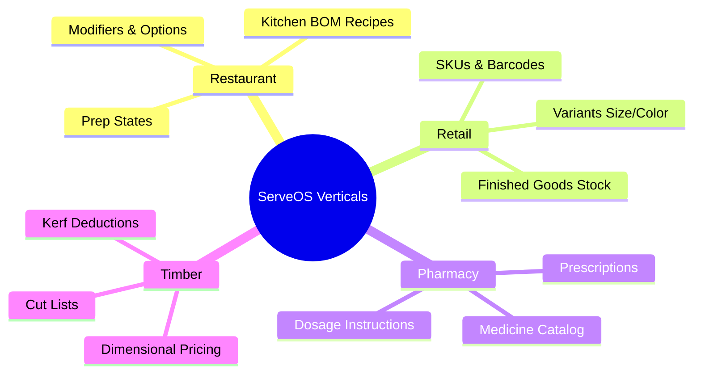

# Domain & Functional Documentation

## 1. Executive Functional Summary & Core Value Proposition

ServeOS is a multi-tenant SaaS commerce and operations platform designed to provide an omnichannel, unified data model for businesses operating across various verticals. By consolidating online storefront orders and counter Point of Sale (POS) transactions into a single system, ServeOS guarantees real-time consistency for inventory, sales data, and customer profiles.

> [!TIP]
> **Core Value Proposition**: Businesses can seamlessly manage multi-branch operations while ServeOS handles the complexity of varying industry requirements through a robust multi-vertical architecture.

### Key Capabilities:
- **Omnichannel Unified Data Model**: Online web orders, POS counter sales, and WhatsApp conversational commerce all feed into identical order processing and fulfillment engines.
- **Tenant Isolation & Multi-Branch**: Deep multi-tenancy ensures complete data isolation. Tenants can manage global operations while retaining branch-level overrides for pricing, stock, and fulfillment.
- **Multi-Vertical Architecture**: Purpose-built configuration modules dynamically tailor the catalog, UI, and business logic to four distinct verticals: `restaurant`, `retail`, `pharmacy`, and `timber`.

---

## 2. Multi-Vertical Engine Matrix

ServeOS employs a flexible multi-vertical engine. The platform's behavior and data structures adapt based on the configured vertical of the tenant.

### Vertical Comparison Table

| Capability | Restaurant | Retail | Pharmacy | Timber |
|---|---|---|---|---|
| **Modifiers** | Heavy (Add-ons, removes) | Light (Gift wrapping) | None | Light (Finishes) |
| **Variants** | None/Size | Heavy (Size, Color) | Dosage/Size | Dimensions |
| **Recipes / BOM** | Full (Kitchen BOM) | Kits/Bundles | Compounds | None |
| **Prescriptions** | No | No | Yes (Upload/Verify) | No |
| **Cut Lists** | No | No | No | Yes (Length/Width) |
| **Stock Tracking** | Ingredients deduction | Finished Goods | Finished Goods | Raw Material / Sheets |
| **Catalog Structure** | Category -> Item -> Modifier | Category -> Product -> Variant | Category -> Medicine -> Dose | Category -> Wood Type -> Dimensions |
| **Storefront UI** | Grid, Image-heavy | Standard E-commerce | List, details-focused | Table layout, dimension inputs |
| **Ordering Flow** | Dine-in/Pickup/Delivery | Delivery/Pickup | Prescription Approval -> Delivery | Cut-list calc -> Quote -> Pickup/Delivery |

### Deep Dive into Verticals

#### **Restaurant**
- **Catalog**: Highly dependent on Modifier groups (e.g., "Choose Meat", "No Onions") and options.
- **Inventory**: Relies on kitchen Bill of Materials (BOM) recipes to automatically deduct ingredient stock (raw materials) when finished plates are sold.
- **Flows**: Supports preparation states (`received`, `preparing`, `ready`), and various fulfillment modes (Dine-in, Pickup, Delivery).

#### **Retail**
- **Catalog**: Driven by SKUs and Barcodes. Heavy use of Variants (e.g., T-shirt: Size M, Color Red).
- **Inventory**: Tracks finished-goods stock. 
- **Flows**: Standard cart-to-checkout flows optimized for fast scanning at the POS.

#### **Pharmacy**
- **Catalog**: Focused on medicine cataloging, active ingredients, and dosage instructions.
- **Flows**: Incorporates a mandatory Prescription upload and pharmacist verification workflow before fulfillment is authorized.

#### **Timber**
- **Catalog**: Dimensional pricing based on inputs (`m`, `m2`, `bf`). 
- **Flows**: Customers input desired length, width, and thickness. The system generates cut-list attributes and calculates kerf deductions (default: 3mm fixed kerf, 300mm minimum offcut).

---

## 3. Core Functional Modules & Workflows

### 3.1 Catalog & Pricing
The foundation of the commerce engine, supporting robust product management.
- **Entities**: Categories, Products, Variants, Modifiers.
- **Localization**: Bilingual support (EN/AR names and descriptions).
- **Branch Overrides**: Base prices and availability can be overridden at the branch level.
- **Versioning**: Uses `catalog_versions` to ensure historical order integrity and safe deployment of catalog updates.
- **Dimensional Pricing**: specialized logic for the timber vertical.

### 3.2 Ordering & Checkout
An omnichannel ordering pipeline.
- **Channels**: Web storefront, POS, WhatsApp bot.
- **Status Tracking**: Uses secure status tokens for unauthenticated customer tracking.
- **Fulfillment**: Supports delivery zones with dynamic min-order values, ETA calculations, and delivery fees.
- **Financials**: Integrated VAT calculation and flexible discount policies.

### 3.3 POS (Point of Sale)
A comprehensive Electron-based desktop POS application for in-store operations.
- **Authentication**: Device pairing via a 24h 6-digit code. Cashiers authenticate via PIN/session auth.
- **Shift Management**: Full lifecycle including open float, cash counts, pay-ins/pay-outs, safe drops, and end-of-shift variance calculation.
- **Transactions**: Sales recording with split tenders (`cash`, `card`, `other`).
- **Authorization**: Line/Order voids and manual discounts require manager authorization grants.
- **Reporting**: Generates X-Reports (mid-shift) and Z-Reports (end-of-shift).
- **Offline Mode**: Supports parked orders (`pos_held_tickets`) and asynchronous offline sync ingestion when connectivity returns.

### 3.4 Inventory Management
Tracks the physical movement and availability of items.
- **Item Types**: `ingredient`, `finished_good`, `raw_material`.
- **Storage**: Defined locations per branch.
- **Stock Ledger**: An append-only `stock_ledger` records all movements to guarantee auditability.
- **Tracking**: FIFO lot tracking with expiry date management.
- **Automation**: Recipe/BOM auto-deductions upon order placement. Automatic generation of draft Purchase Orders (POs) based on defined reorder rules.
- **Auditing**: Stock count audit sessions to reconcile physical stock with system records.

### 3.5 Purchasing & Supplier Management
Streamlines the procurement process.
- **Suppliers**: Centralized directory.
- **PO Lifecycle**: `draft` -> `sent` -> `partially_received` -> `received` -> `closed`.
- **Receiving**: Goods receiving creates new inventory lots. The system matches invoice totals and calculates variances (`getPoVariance`).
- **Communication**: Automated Email PO delivery to suppliers via Resend integrations.

### 3.6 WhatsApp Conversational Commerce
An automated conversational bot for ordering via WhatsApp.
- **State Machine**: Transitions through `idle` -> `branch` -> `categories` -> `products` -> `cart` -> `fulfillment` -> `confirm` -> `placed`.
- **Handoff**: Generates secure cart tokens to seamlessly handoff users to the web checkout for payment.
- **Notifications**: Pushes outbound proactive order status updates.

### 3.7 Customer Directory & B2B Trade Accounts
Manages end-consumer and business clients.
- **B2C**: Standard customer accounts and session management.
- **B2B Wholesale**: Trade customer verification, assigned discount percentage tiers, and terms of credit.

### 3.8 Audit & Security
Ensures high trust and compliance across all operations.
- **Tamper-Evident Logs**: `audit_events` utilize a hash-chained structure (SHA-256 prev/entry hashes) making tampering mathematically infeasible.
- **Mutation Tracking**: System-wide logging of critical state changes.
- **Fingerprinting**: Captures actor fingerprints (`deviceId`, `appVersion`, `ip`, `userAgent`) for comprehensive auditing.

### 3.9 SaaS Tenancy & Billing
Manages the lifecycle of businesses using ServeOS.
- **Onboarding**: Tenant registration followed by platform admin approval.
- **Subscriptions**: 3-tier model (`Basic`, `Pro`, `Enterprise`).
- **Entitlements**: Quota and feature entitlement gates based on the active subscription.
- **Billing**: Manual billing invoice queue with a workflow for payment proof verification.

---

## 4. Actors and Roles Matrix

The system enforces strict Role-Based Access Control (RBAC) across tenants and the platform.

| Actor Type | Role / Context | Allowed Actions & Permissions |
|---|---|---|
| **Platform Admin** | ServeOS HQ | Approve/Reject tenants, manage global SaaS billing, monitor system health, oversee platform audits. |
| **Tenant Owner** | Tenant Root | Full access to tenant configuration, manage subscriptions, create branches, define roles, view all cross-branch reports. |
| **Manager** | Branch Level | Manage branch inventory, view branch reporting, approve POS voids/discounts, manage staff shifts. |
| **Staff/Cashier** | Branch POS | Operate POS, open/close shifts, process sales, park orders. Restricted from voids/discounts without auth. |
| **Customer** | End-User (Web/WA) | Browse catalog, place orders, view order history, track order status. |
| **System** | Background Jobs | Auto-deduct inventory, generate draft POs, sync offline POS transactions, emit webhook events. |

---

## 5. PRD Traceability & Cross-References

For deeper technical and product specifications, refer to the following documents:

- **Master Plan**: [MASTER-PRD](file:///d:/work/AgencyOS/ServeOs/docs/prds/MASTER-PRD.md)
- **Feature Specs**: 
  - [PRD-001: Core Architecture](file:///d:/work/AgencyOS/ServeOs/docs/prds/PRD-001.md)
  - [PRD-002: Advanced Reporting](file:///d:/work/AgencyOS/ServeOs/docs/prds/PRD-002.md)
  - [PRD-003: ZATCA E-Invoicing](file:///d:/work/AgencyOS/ServeOs/docs/prds/PRD-003.md)

> [!WARNING]
> Ensure any functional changes implemented in code reflect updates in these documents to maintain traceability.
